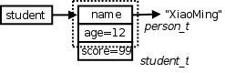
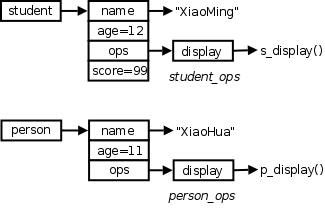

Class and Object-oriented Methodology
=========================================

**TODO: THIS WHOLE CHAPTER NEEDS OVERHAUL**

.. figure:: ../images/road-works-sign.gif

``class`` is a C++ keyword to define a class type, which is an extension to C's ``struct``. Similiar to struct type, after defining a class type, we can define a variable of that class type. This variable is called an **instance** or **object** of that class. From this point on, a whole bunch of theories and practices are developed under the name of **object-oriented methodology**. **Encapsulation**, **inheritance**, and **polymorphism** are the three most significant characteristics of object-oriented methodology. We will introduce these as well as related C++ syntax.

Encapsulation
--------------------

When programming in C, we often encapsulate related variables and functions in a .c source file and call that a module. We declare those variables and functions interior to the module as ``static``, which are invisible outside the module. We export public variables and functions, i.e. those declared without ``static``, by putting their declarations in a .h header file. By including the header file, those public interfaces can be used from outside.

Take a look at the ``FILE *`` pointer from ``stdio.h``, this reflects another way of modularization. The ``FILE *`` pointer is an **opaque handler**, which means ``FILE`` struct encapsulates some data members that the caller should never know about. All that can be done by the caller is to get the ``FILE *`` pointer from ``fopen`` and pass it to other library functions, letting those library functions maintain private data within ``FILE`` struct. The library functions know about private data in ``FILE`` struct because they all come from the same module. We will mimic this method in the following C code:

``person.h``

.. code-block:: c++
   :linenos:

   #ifndef PERSON_H
   #define PERSON_H

   typedef void *HPERSON;

   HPERSON person_create(const char *name, int age);
   void person_display(const HPERSON p);
   void person_delete(HPERSON p);

   #endif /* PERSON_H */

``person.c``

.. code-block:: c++
   :linenos:

   #include <stdio.h>
   #include <string.h>
   #include <stdlib.h>
   #include "person.h"

   typedef struct
   {
        char *name;
        int age;
   } person_t;

   HPERSON person_create(const char *name, int age)
   {
        printf("create person\n");
        person_t *p = malloc(sizeof(person_t));
        p->name = malloc(strlen(name)+1);

        strcpy(p->name, name);
        p->age = age;
        return p;
   }

   void person_display(const HPERSON p)
   {
        printf("<<<< display person information >>>>\n");
        printf(" Name:%s\n Age:%d\n", ((person_t *)p)->name, ((person_t *)p)->age);
   }

   void person_delete(HPERSON p)
   {
        printf("delete person\n");
        free(((person_t *)p)->name);
        free(p);
   }

``main.c``

.. code-block:: c++
   :linenos:

   #include "person.h"

   int main(void)
   {
        HPERSON person = person_create("XiaoMing", 12);
        person_display(person);
        person_delete(person);
        return 0;
   }

``person.c`` is a module. It encapsulates some private data in ``person_t`` struct. All functions provided in this module have access to private members in ``person_t`` struct. They can initialize a ``person_t`` object, display it in a user-friendly way, or delete it. However, codes from outside can only keep and pass pointers to ``person_t`` objects, but can't access private members. The trick is to expose the pointer to ``person_t`` as a ``void`` pointer type ``HPERSON``, which cannot be dereferenced.

The above C code achieve the effect of encapsulation by modularization and some tricks, whereas C++ supports encapsulation by its syntax. Now we rewrite the code in C++. First, define a ``Person`` class in ``person.h``:

``person.h``

.. code-block:: c++
   :linenos:

   #ifndef PERSON_H
   #define PERSON_H

   class Person
   {
   public:	
        Person(const char *name, int age);
        ~Person();    
        void display() const;
   private:
        char *name;
        int age;
   };

   #endif //PERSON_H

C++'s class extends C's struct in two ways. First, C++'s class can have not only data members but also member functions. Second, class memebers can have **access specifiers**: ``private`` member can only be accessed by member functions of the same class, and ``public`` members can be accessed from outside. In the above example, ``name`` and ``age`` are two private members, they can only be accessed by ``Person()``, ``~Person()``, and ``display()``, but those member functions in turn are public members and can be accessed from ``main`` function or member functions of other classes. In other words, ``main`` function can only access data members in ``Person`` class through public member functions provided by it. This is essentially the same way we did in the above C code.

Note the semicolon ``;`` at the end of the class definition, which is often omitted by C++ newbies. This follows the same syntax as C's struct. In fact, class and struct have the same syntax in C++. C++'s struct can also have member functions and access specifiers. There's only one little difference: if the access specifier is not explicitly specified, the default specifier for a class member is private, but for a struct member it is public. This syntax keeps compatible with C. If we compile C code with a C++ compiler, C's struct is taken as C++'s struct with no member functions and with all data members public.

Now look at the implementation of ``Person`` class:

``person.cpp``

.. code-block:: c++
   :linenos:

   #include <iostream>
   #include <cstring>
   #include "person.h"
   using namespace std;

   Person::Person(const char *name, int age)
     :name(NULL), age(age)
   {
     cout<<"create person"<<endl;
     this->name = new char[strlen(name)+1];
     strcpy(this->name, name);
   }

   void Person::display() const
   {
     cout<<"<<<< display person information >>>>"<<endl
         <<" Name:"<<name<<endl<<" Age:"<<age<<endl;
   }

   Person::~Person()
   {
     cout<<"delete person"<<endl;
     delete[] name;
   }

Member function names are under the namespace of their class. Therefore, the full name of member function ``display`` is ``Person::display``, similar to ``person_display`` in the above C code. We can see from ``nm`` output what constitutes a member function name::

   $ g++ -c person.cpp
   $ nm person.o
   ......
   00000200 T _ZNK6Person7displayEv
   ......

Member function names should not be prefixed by their class namespace when declared within ``class {...}`` declaration, but must be prefixed when declared outside. ``Person::Person`` and ``Person::~Person`` are two special member functions called **constructor** and **destructor** respectively. A constructor has the same name as its class. A destructor's name is composed of a tilde ``~`` and its class name. These two functions have no return values. Note they do not return ``void``, they have no return values or return types at all.

We will take a look at the ``main`` function first, and then see how it interacts with ``Person`` class.

``main.cpp``

.. code-block:: c++
   :linenos:

   #include "person.h"

   int main()
   {
     Person *person = new Person("XiaoMing", 12);
     person->display();
     delete person;
     return 0;
   }

``person`` points to an object allocated by ``new`` operator and initialized by ``()`` operator. We have seen this syntax before. But now we deal with a custom type instead of built-in type, and we pass two arguments. Actually we are calling a constructor called ``Person``.

The caller:

.. code-block:: c++
   :linenos:

   Person *person = new Person("XiaoMing", 12);

The callee:

.. code-block:: c++
   :linenos:

   Person::Person(const char *name, int age)
     :name(NULL), age(age)
   {
     cout<<"create person"<<endl;
     this->name = new char[strlen(name)+1];
     strcpy(this->name, name);
   }

The ``:name(NULL), age(age)`` part in constructor is called **initializer list**. Member ``name`` is initialized to ``NULL``, and member ``age`` is initialized to parameter ``age``, which is 12. Then in the body of constructor a string is allocated to member ``name``, and parameter ``name``, which values ``"XiaoMing"``, is copied into the string pointed to by member ``name``. After construction, the object looks like:

Why didn't I show any member functions in the object? In fact, each ``Person`` object has its own data members, but the three member functions are shared among all ``Person`` objects. Then how does a member function such as ``Person::display`` differentiate between object A and object B? It has to know who's calling it so as to display the caller's information. The C code above solves this problem by providing a parameter identifying the caller.

.. code-block:: c++
   :linenos:

   void person_display(const HPERSON p);

``Person::display`` does have an **implied parameter** for identifying the caller. It is called ``this`` pointer. When we invoke a member function like ``person->display()``, we actually pass ``person`` to ``Person::display`` as the implied parameter ``this``. We can think of this invocation like ``Person::display(person)``. ``this`` pointer can be used in member functions to refer to the caller object. For example, in constructor we refer to member ``name`` by ``this->name``, and refer to parameter ``name`` by ``name`` alone. In an unambiguous context, such as ``Person::display``, ``this->`` can be omitted, so we can refer to member ``name`` by ``name`` alone.

Note the keyword ``const`` at the end of the prototype of ``Person::display``. That means the object pointed to by ``this`` pointer is readonly, thus inhibiting ``Person::display`` from modifying its data members.

The ``delete person;`` statement at the end of ``main`` function calls the destructor ``Person::~Person``. We have allocated a string in the constructor, so the destructor is responsible for freeing it. If we do not do this in the destructor, and we ``new`` and ``delete`` many objects, the memory will be clumped with many strings with no pointer referencing them. This is called **memory leak**. A class can have many overloaded constructors, each with different parameter list, but can have only one destructor, because the destructor cannnot take any parameter.

const Members
--------------------

Data members of a class can be qualified with ``const``. ``const`` data members can be initialized with a constant in the initializer list of a constructor. From then on they cannot be modified. For example,

.. code-block:: c++
   :linenos:

   class A
   {
   public:
           A(int size):SIZE(size){};
           const int SIZE;
   };

   int main()
   {
           A a(100);
           A b(200);
           return 0;
   }

Two objects ``a`` and ``b`` are allocated on the stack of ``main`` function. They will be automatically destructed when their lifetimes are over, i.e. when ``main`` function returns. ``a`` has a member ``SIZE`` initialized to 100, and ``b`` has a member ``SIZE`` initialized to 200. Once initialized, those ``const`` data members cannot be modified, even in the body of the constructor. Thus, we cannot write the constructor as

.. code-block:: c++
   :linenos:

   A(int size){ SIZE=size; };

Initialization and assignment are different. Remember the same principle holds when we initialize a ``const`` variable in C. We can write

.. code-block:: c++
   :linenos:

   const int i=10;

but not

.. code-block:: c++
   :linenos:

   const int i;
   i=10;

Note in this example we implement the constructor within the ``class {...}`` declaration, rather than merely declare it first and implement later. Member functions directly implemented in ``class {...}`` declaration are taken as ``inline`` functions.

static Members
------------------------

We know that each object of a class has its own copy of data members, but data members qualified with ``static`` are exceptional. ``static`` data members are shared by all objects of one class. They don't belong to any specific object. There won't be multiple copies of ``static`` data members. For each class there's only one copy. For example,

.. code-block:: c++
   :linenos:

   #include <iostream>
   using namespace std;

   class A
   {
   public:
           static int i;
   };

   int A::i;

   int main()
   {
     A a, b;
     a.i = 10;
     b.i = 20;
     cout<<a.i<<endl<<b.i<<endl;
     A::i = 30;
     cout<<a.i<<endl<<b.i<<endl;
     return 0;
   }

``i`` is a ``static`` data member. Although there are two instances of class ``A``, there's only one instance of ``i``. It can be accessed through either ``a.i`` or ``b.i``, or even through ``A::i``. ``i`` is not allocated with object ``a`` or ``b``, it's allocated and initialized when the program starts to run, in the same way as global variables. Note in the ``class {...}`` declaration we can only declare a static member, but not define it. We should define it in the global scope, just like we define a global variable.

``static`` can also be used to qualify member functions. We know a member function is special in that it has an implied ``this`` parameter. But a ``static`` member function doesn't have ``this`` parameter. Therefore it cannot access non-static data members through ``this`` pointer. In other words, ``static`` member functions can only access ``static`` data members, they are just another form of global functions and variables with a namespace prefix.

Overloaded Member Operators
------------------------------

We have seen that an overloaded operator is a special form of function. The same is true with an overloaded member operator. Then which operator should be implemented within a class as a member function, and which should be implemented outside? By convention, asymmetric operators such as ``+=`` and ``-=`` should be implemented as member functions, while symmetric operators such as ``+`` and ``-`` should not. That's only a convention, not a syntax restriction. 

Let's continue our example of ``Complex`` type. We overload ``+=`` operator as a member function:

.. code-block:: c++
   :linenos:

   Complex& Complex::operator+=(const Complex&);

In an earlier section we overloaded ``+`` operator as:

.. code-block:: c++
   :linenos:

   Complex operator+(const Complex&, const Complex&);

Naturally it has two parameters, since it's a binary operator. But the member operator ``+=`` has only one parameter, where is the other? Remember a member function has an implied ``this`` parameter. That's the left operand, while the only parameter is the right operand. There's another difference. The ``+`` operator has a return value of type ``Complex``, whereas the ``+=`` operator has a return value of type ``Complex&``. Think about it for a while.

Here is the full code.

.. code-block:: c++
   :linenos:

   #include <iostream>
   using namespace std;

   class Complex
   {
           friend ostream& operator<<(ostream&, const Complex&);
   public:
           Complex(double real, double img):real(real),img(img){}
           Complex& operator+=(const Complex& b)
           {
                   real += b.real;
                   img += b.img;
                   return *this;
           }
   private:
           double real,img;
   };

   ostream& operator<<(ostream& o, const Complex& a)
   {
           o<<a.real<<'+'<<a.img<<'i';
           return o;
   }

   int main(void)
   {
           Complex a(1,2), b(3,4);
           a += b;
           cout<<a<<endl;
           return 0;
   }

We declare ``real`` and ``img`` as private members to protect them from being accessed outside. Then how to implement ``<<`` operator? To print a Complex object, we must access its two private members. Besides, ``<<`` operator cannot be implemented as a member of ``Complex`` class, because its left operand is an ``ostream`` object, not a ``Complex`` object. We introduce a new keyword ``friend``, which can declare a function or class as a "friend" of another class and allow access to its private members.

The Big Three
---------------------

Constructor, destructor and assignment operator are the most important functions of a class. They are usually referred to as the big three. The big three are special because if they are absent the compiler will automatically generate a synthesized version for the class.

For a class ``A``, if there isn't any constructor, the compiler will synthesize a default constructor with no parameter.

.. code-block:: c++
   :linenos:

   A(void);

If we define an object ``a`` of class ``A``,

.. code-block:: c++
   :linenos:

   A a;

then the default constructor is called and all data members get allocated. Note if ``a`` has a data member of pointer type, only the pointer itself is allocated. To allocate the space pointed to by the pointer we have to implement our own constructor. As long as we provide at least one constructor for the class, whether it has any parameter or not, the compiler will not synthesize a default constructor. Note we can't call a constructor with no parameter as:

.. code-block:: c++
   :linenos:

   A a();

This statement has ambiguity. We can also take it as a function declaration which is named ``a``, has no parameter, and returns an object of type ``A``. Therefore C++ syntax forbids this usage, although it makes good sense. 

Copy constructor is a special constructor with the following form:

.. code-block:: c++
   :linenos:

   A(const A &a);

If a copy constructor is absent, the compiler will also provide a synthesized version for the class. A copy constructor is invoked in the following case.

.. code-block:: c++
   :linenos:

   A a;
   A b = a;
   A c(a);

Here the ``=`` isn't an assignment operator, but an initializor. ``A b = a;`` is identical to ``A b(a);``. In both cases the copy constructor is called with a parameter ``a``. Therefore ``b`` and ``c`` are constructed with ``a`` as the role model. If the synthesized copy constructor is called, all data members of ``a`` will be copied to ``b`` and ``c``. If ``A`` has a data member of pointer type, only the pointer itself is copied to ``b`` and ``c``, rendering three pointers pointing to the same space. This behavior is called shallow copy. If we want the behavior of deep copy, that is, both the pointer and the space being pointed to are copied, we should implement our own version of copy constructor.

If a destructor is absent, the compiler will provide a synthesized version:

.. code-block:: c++
   :linenos:

   ~A(void);

The destructor will be called when an object allocated by ``new`` operator is ``delete``ed, or when an object allocated on stack runs out of its duration. Global and ``static`` objects are constructed when the program starts and destructed when the program terminates. If the synthesized destructor is called, all data members are deallocated. If ``A`` has a data member of pointer type, only the pointer itself is deallocated, the space pointed to will be left unchanged, and probably with no pointer referencing it. This is called **memory leak**. We have to implement our own version of destructor to avoid this behavior.

Assignment operator has the form:

.. code-block:: c++
   :linenos:

   A &operator=(const A &a);

If an assignment operator is absent, the compiler will provide a synthesized version for the class. An assignment operator is invoked in the following case.

.. code-block:: c++
   :linenos:

   A a, b;
   b = a;

``b = a;`` is an assignment, not initialization. Note the difference between ``b = a;`` and ``A b = a;``. If the synthesized assignment operator is called, all data members of ``a`` will be copied to ``b``. If ``A`` has a data member of pointer type, only the pointer itself is copied to ``b``, rendering two pointers pointing to the same space. If we want the behavior of deep copy, we should implement our own version of assignment operator.

To summarize, if a class has data members of pointer type, the behavior of compiler synthesized functions usually isn't what we want. Therefore, to define a class with pointer members, we must implement the big three ourselves. Even if you define a class without pointer members, you'd better implement the big three to make sure everything works as you expect.

There's no string type in C, strings can only be represented by ``char`` pointer or array. Now we implement a C++ string class, supporting operations such as getting length, concatenating, and printing. Once the class is done, codes using this class can be very tidy.

mystring.h

.. code-block:: c++
   :linenos:

   #include <iostream>
   using namespace std;

   class MyString
   {
   friend ostream &operator<<(ostream &, const MyString &);
   friend MyString operator+(const MyString &, const MyString &);
   public:
           MyString(const char *);
           MyString(const MyString &);
           ~MyString(void);
           MyString &operator=(const MyString &);
           int length(void) const;
           bool isEmpty(void) const;
   private:
           char *data;
           int len;
   };

Because ``MyString`` class encapsulates a pointer member ``data``, we must implement the big three ourselves. We overload ``+`` operator for string concatenation.

mystring.cpp

.. code-block:: c++
   :linenos:

   #include <iostream>
   #include "mystring.h"
   using namespace std;

   MyString::MyString(const char *str)
   {
     cout<<"ctor"<<endl;

     if(str==NULL) {
       len = 0;
       data = new char[1];
       *data = '\0';
     } else {
       len = strlen(str);
       data = new char[len+1];
       strcpy(data, str);
     }
   }

   MyString::MyString(const MyString &other)
   {
     cout<<"copy ctor"<<endl;

     len = other.len;
     data = new char[len+1];
     strcpy(data, other.data);
   }

   MyString::~MyString(void)
   {
     cout<<"dtor"<<endl;

     delete[] data;
   }

   MyString &MyString::operator=(const MyString &other)
   {
     cout<<"assignment"<<endl;

     if(this==&other)
       return *this;

     delete[] data;
     len = other.len;
     data = new char[len+1];
     strcpy(data, other.data);
     return *this;
   }

   int MyString::length(void) const
   {
     return len;
   }

   bool MyString::isEmpty(void) const
   {
     return len==0;
   }

   ostream &operator<<(ostream &out, const MyString &str)
   {
     out << str.data;
     return out;
   }

   MyString operator+(const MyString &a, const MyString &b)
   {
     cout<<"concatenate"<<endl;

     MyString temp("");

     delete[] temp.data;
     temp.len = a.len + b.len;
     temp.data = new char[temp.len + 1];
     strcpy(temp.data, a.data);
     strcat(temp.data, b.data);

     return temp;
   }

Note we do sanity check at the beginning of the assignment operator:

.. code-block:: c++
   :linenos:

   if (this == &other)
       return *this;

Think about it: What if we didn't check it?

main.cpp

.. code-block:: c++
   :linenos:

   #include <iostream>
   #include "mystring.h"
   using namespace std;

   int main()
   {
           MyString str("hello");
           MyString str1 = str;
           cout<<"Length of str1: "<<str1.length()<<endl;
           cout<<"Value of str1: "<<str1<<endl;

           MyString str2 = "";
           cout<<"Is str2 empty? "<<(str2.isEmpty()?"true":"false")<<endl;

           str2 = " world";
           cout<<"Now value of str2: "<<str2<<endl;

           cout<<"Now value of str: "<<str1+str2<<endl;
           cout<<"Value of another expression: "<<str1 + "_world"<<endl;
           cout<<"Value of yet another expression: "<<"Hello," + str2<<endl;

           MyString str3 = str1 + str2;
           cout<<"Value of str3: "<<str3<<endl;

           return 0;
   }

The user code is really clean. No ``malloc``, ``free``, ``strlen``, ``strcat`` any more. Perhaps much to your surprise, you can make such assignment:

.. code-block:: c++
   :linenos:

   str2 = " world";

The right operand of our assignment operator has type ``MyString&``, not ``const char *``. How can that be done? The compiler does an **implicit conversion** here, converting from ``const char *`` to ``MyString``, based on our constructor. The steps are:

#. Taking ``"world"`` as an argument, construct a temporary object.
#. Taking the temporary object as the right operand, invoke the assigment operator.
#. Destruct the temporary object.

Here's a segment taken from the output, which verifies these steps::

   ...
   ctor
   assignment
   dtor
   Now value of str2:  world
   ...

This rule also applies to the code ``str1 + "_world"``. In a word, defining a constructor taking one parameter also implies an implicit conversion rule.

The statement ``MyString str3 = str1 + str2;`` also involves complicated steps:

#. Taking ``str1`` and ``str2`` as operands, invoking overloaded operator ``+``.
#. Within the operator ``+``, construct a local variable ``temp`` on stack.
#. Concatenate ``str1`` and ``str2`` and save the result in ``temp``.
#. When it arrives ``return temp;``, first copy construct a temporary object from ``temp``, then return from operator ``+`` and destruct ``temp``.
#. Copy construct ``str3`` from the temporary object constructed in the last step, then destruct the temporary object.

Although in theory we should take all five steps, ``g++`` actually makes proper optimizations. Please analyze the output and figure out the actual steps.

Inheritance
--------------------

A class can **inherit** from another class to get its data members and member functions. They are called **derived class** and **base class** respectively. The main purpose for inventing class inheritance is to reuse existing code.

The ``Person`` class has two members, ``name`` and ``age``. Now we need a ``Student`` class, which conceptually is a kind of ``Person``. It has another member ``score`` besides ``name`` and ``age``. If we write the new class from scratch, ``Person`` and ``Student`` each has its own ``name`` and ``age``, duplicated code is produced. Duplicated code has a bad smell. Since ``Student`` is a kind of ``Person``, it should have what ``Person`` has and behave like ``Person``. Each time we update ``Person`` class, adding new members or changing behaviors, we should update ``Student`` class as well and produce even more duplicated code. If we find a bug in ``Person`` class, we should fix it in both ``Person`` and ``Student`` class. The resulting code is both hard to maintain and error-prone, until class inheritance comes into play.

Let's begin with our familiar C code first, then we'll rewrite it in C++.

student.h

.. code-block:: c++
   :linenos:

   #ifndef STUDENT_H
   #define STUDENT_H

   typedef void *HPERSON;

   HPERSON person_create(const char *name, int age);
   void person_display(const HPERSON p);
   void person_delete(HPERSON p);

   typedef void *HSTUDENT;

   HSTUDENT student_create(const char *name, int age, int score);
   void student_display(const HSTUDENT s);
   void student_delete(HSTUDENT s);

   #endif /* STUDENT_H */

student.c

.. code-block:: c++
   :linenos:

   #include <stdio.h>
   #include <stdlib.h>
   #include <string.h>
   #include "student.h"

   typedef struct
   {
        char *name;
        int age;
   } person_t;

   HPERSON person_create(const char *name, int age)
   {
        printf("create person\n");      
        person_t *p = malloc(sizeof(person_t));
        p->name = malloc(strlen(name)+1);

        strcpy(p->name, name);
        p->age = age;
        return p;
   }

   void person_display(const HPERSON p)
   {
        printf("<<<< display person information >>>>\n");
        printf(" Name:%s\n Age:%d\n", ((person_t *)p)->name, ((person_t *)p)->age);
   }

   void person_delete(HPERSON p)
   {
        printf("delete person\n");
        free(((person_t *)p)->name); 
        free(p);
   }

   typedef struct
   {
        person_t person;
        int score;
   } student_t;

   HSTUDENT student_create(const char *name, int age, int score)
   {
        printf("create student\n");   
        student_t *student = malloc(sizeof(student_t));
        student->person.name = malloc(strlen(name)+1);

        strcpy(student->person.name, name);
        student->person.age = age;
        student->score = score;
        return student;
   }

   void student_display(const HSTUDENT s)
   {
        printf("<<<< display student information >>>>\n");
        printf(" Name:%s\n Age:%d\n Score:%d\n", 
               ((person_t *)s)->name, ((person_t *)s)->age, ((student_t *)s)->score);        
   }

   void student_delete(HSTUDENT s)
   {
        printf("delete student\n");      
        free(((person_t *)s)->name);
        free(s);
   }

main.c

.. code-block:: c++
   :linenos:

   #include "student.h"

   int main(void)
   {

        HSTUDENT student = student_create("XiaoMing", 12, 99);
        student_display(student);
        person_display(student);
        student_delete(student);
        return 0;
   }

A ``person_t`` object is embedded at the beginning of a ``student_t`` object.

Therefore a pointer pointing to a ``student_t`` object can also be taken as a pointer pointing to a ``person_t`` object. Although we specifically define a ``student_display`` function for a ``student_t`` object, the original ``person_display`` function can also apply to a ``student_t`` object.

Now let's see the equivalent C++ code.

student.h

.. code-block:: c++
   :linenos:

   #ifndef STUDENT_H
   #define STUDENT_H

   class Person
   {
   public:	
        Person(const char *name, int age);
        ~Person();    
        void display() const;
   protected:
        char *name;
        int age;
   };

   class Student: public Person
   {
   public:
        Student(const char *name, int age, int score);
        ~Student();
        void display() const;
   private:
        int score;
   };

   #endif //STUDENT_H

The ``protected`` access specifier allows corresponding members to be accessed within derived class, while still protecting them from being accessed outside. The ``private`` members of a class are inaccessible to its derived class, so ``name`` and ``age`` should be declared as ``protected`` instead of ``private``. Note the first line of ``class Student`` declaration:

.. code-block:: c++
   :linenos:

   class Student: public Person

Here the ``public`` keyword indicates how ``Student`` class inherits from ``Person`` class. It determines the access specifier of inherited members in derived class. If the inheritance is ``public``:

======================================  =====================================
access specifier of base class members  access specifier of inherited members
======================================  =====================================
public                                  public
protected                               protected
private                                 inaccessible
======================================  =====================================

If the inheritance is ``protected``:

======================================  =====================================
access specifier of base class members  access specifier of inherited members
======================================  =====================================
public                                  protected
protected                               protected
private                                 inaccessible
======================================  =====================================

If the inheritance is ``private``:

======================================  =====================================
access specifier of base class members  access specifier of inherited members
======================================  =====================================
public                                  private
protected                               private
private                                 inaccessible
======================================  =====================================

Just like ``person_t`` and ``student_t`` in the prior C code, a ``Person`` object is embedded at the beginning of a ``Student`` object. Note if the embedded ``Person`` object has private members, they are accessible to member functions inherited from ``Person`` class but inaccessible to other member functions of ``Student`` class.

Here is the implementation:

student.cpp

.. code-block:: c++
   :linenos:

   #include <iostream>
   #include <cstring>
   #include "student.h"
   using namespace std;

   Person::Person(const char *name, int age)
     :name(NULL), age(age)
   {
     cout<<"create person"<<endl;
     this->name = new char[strlen(name)+1];
     strcpy(this->name, name);
   }

   void Person::display() const
   {
     cout<<"<<<< display person information >>>>"<<endl
         <<" Name:"<<name<<endl<<" Age:"<<age<<endl;
   }

   Person::~Person()
   {
     cout<<"delete person"<<endl;
     delete[] name;
   }

   Student::Student(const char *name, int age, int score)
     :Person(name, age), score(score)
   {
     cout<<"create student"<<endl;
   }

   void Student::display() const
   {
     cout<<"<<<< display student information >>>>"<<endl
         <<" Name:"<<name<<endl<<" Age:"<<age<<endl
         <<" Score:"<<score<<endl;
   }

   Student::~Student()
   {
     cout<<"delete student"<<endl;
   }

Note the initializer list in the constructor of ``Student`` class:

.. code-block:: c++
   :linenos:

   Student::Student(const char *name, int age, int score)
       :Person(name, age), score(score)

When we construct an object from a class, the constructor of its base class is always invoked before other initialization steps. If class ``C`` inherits class ``B``, which in turn inherits class ``A``, then when we construct an object from class ``C``, ``A``'s constructor is invoked first to initialize members of part ``A``, ``B``'s constructor is invoked next to initialize members of part ``B``, ``C``'s constructor is invoked last to initialize the remaining part of the object.

If we do not call ``Person(name, age)`` in the initializer list, the default ``Person()`` constructor with no parameter will be called. Because we do not define such a constructor, and because we do provide a constructor so that compiler's synthesized version is suppressed, the code will end up with a compile error. Please try it yourself.

Here is the user code:

main.cpp

.. code-block:: c++
   :linenos:

   #include "student.h"

   int main()
   {
     Student *student = new Student("XiaoMing", 12, 99);
     student->display();

     Person *p = student;
     p->display();

     delete student;
     return 0;
   }

As we can see, ``p->display()`` is invoking ``Person::display()`` because ``p`` is of type ``Person *``, while ``student->display()`` is invoking ``Student::display()`` becase ``student`` is of type ``Student *``. If the derived class inherits a member function from the base class and implements another function with the same name, it's own version **overrrides** the inherited version. In this case, if we don't implement ``Student::display()``, then ``student->desplay()`` is also invoking ``Person::display()``, because that function is inherited and not overridden.

Think about this: we already see a pointer of base class type points to an object of derived class, then can we make a pointer of derived class type point to an object of base class? Why?

Polymorphism
----------------------

In the example of the last section, ``p->display()`` is invoking ``Person::display()``. If ``p`` points to a ``Student`` object, only ``name`` and ``age`` will be displayed, and ``Person::display()`` knows nothing about ``score``. Sometimes what we really want is that the most verbose information should be displayed. If ``p`` points to a ``Person`` object, ``name`` and ``age`` should be displayed by ``p->display()``. If ``p`` points to a ``Student`` object, ``name``, ``age`` and ``score`` should be displayed by ``p->display()``. This is called **polymorphism**. How to achieve this? Again we will start from C code.

student.h

.. code-block:: c++
   :linenos:

   #ifndef STUDENT_H
   #define STUDENT_H

   typedef void *HPERSON;

   HPERSON person_create(const char *name, int age);
   void person_delete(HPERSON p);

   typedef void* HSTUDENT;

   HSTUDENT student_create(const char *name, int age, int score);
   void student_delete(HSTUDENT s);

   void display(HPERSON);

   #endif /* STUDENT_H */

student.c

.. code-block:: c++
   :linenos:

   #include <stdio.h>
   #include <stdlib.h>
   #include <string.h>
   #include "student.h"

   typedef struct
   {
        char *name;
        int age;
        struct operations *ops;
   } person_t;

   struct operations
   {
        void (*display)(const HPERSON);
   };

   static void p_display(const HPERSON p)
   {
        printf("<<<< display person information >>>>\n");
        printf(" Name:%s\n Age:%d\n", ((person_t *)p)->name, ((person_t *)p)->age);
   }

   static struct operations person_ops = { p_display };

   HPERSON person_create(const char *name, int age)
   {
        printf("create person\n");      
        person_t *p = malloc(sizeof(person_t));
        p->name = malloc(strlen(name)+1);
        p->ops = &person_ops;

        strcpy(p->name, name);
        p->age = age;
        return p;
   }

   void person_delete(HPERSON p)
   {
        printf("delete person\n");
        free(((person_t *)p)->name); 
        free(p);
   }

   typedef struct
   {
        person_t person;
        int score;
   } student_t;

   static void s_display(const HSTUDENT s)
   {
        printf("<<<< display student information >>>>\n");
        printf(" Name:%s\n Age:%d\n Score:%d\n", 
               ((person_t *)s)->name, ((person_t *)s)->age, ((student_t *)s)->score);        
   }

   static struct operations student_ops = { s_display };

   HSTUDENT student_create(const char *name, int age, int score)
   {
        printf("create student\n");
        student_t *s = malloc(sizeof(student_t));
        ((person_t *)s)->name = malloc(strlen(name)+1);
        ((person_t *)s)->ops = &student_ops;

        strcpy(((person_t *)s)->name, name);
        ((person_t *)s)->age = age;
        s->score = score;
        return s;
   }

   void student_delete(HSTUDENT s)
   {
        printf("delete student\n");
        free(((person_t *)s)->name);
        free(s);
   }

   void display(HPERSON p)
   {
        ((person_t *)p)->ops->display(p);
   }

main.c

.. code-block:: c++
   :linenos:

   #include "student.h"

   int main()
   {
        HSTUDENT student = student_create("XiaoMing", 12, 99);
        display(student);
        student_delete(student);

        HPERSON person = person_create("XiaoHua", 11);
        display(person);
        person_delete(person);

        return 0;
   }

``person_t`` has a pointer ``ops`` pointing to an ``operations`` structure. Since ``person_t`` is embedded in ``student_t``, ``student_t`` also has the ``ops`` pointer. ``person_ops`` and ``student_ops`` are two ``operations`` structures, which consists of various function pointers. In this case only one function pointer ``display`` is contained. ``person_ops``'s ``display`` pointer points to ``p_display`` function, while ``student_ops``'s ``display`` pointer points to ``s_display`` function. A ``student_t`` object's ``ops`` member will be initialized to ``student_ops`` while a ``person_t`` object's ``ops`` member will be initialized to ``person_ops``. That way a ``person_t`` object and a ``student_t`` object will invoke different functions through ``ops->display`` pointer.

We have to access the corresponding ``operations`` structure through an ``ops`` pointer embedded in ``persion_t``. Then why not embed the ``operations`` structure directly into ``person_t``? Please think about it.

Now let's see how to achieve polymorphism in C++.

student.h

.. code-block:: c++
   :linenos:

   #ifndef STUDENT_H
   #define STUDENT_H

   class Person
   {
   public:
        Person(const char *name, int age);
        ~Person();    
        virtual void display() const;
   protected:
        char *name;
        int age;
   };

   class Student: public Person
   {
   public:
        Student(const char *name, int age, int score);
        ~Student();
        virtual void display() const;
   private:
        int score;
   };

   #endif //STUDENT_H

This header file differs from the previous version in only one place: The ``display`` function is declared ``virtual``. A class with virtual functions has a hidden pointer member ``vptr``, which points to a virtual function table. ``vptr`` is similar to the ``ops`` pointer and virtual function table is similar to the ``operations`` structure in the above C code. When constructing a ``Person`` object, ``vptr`` is initialized to a virtual function table similar to ``person_ops`` in the above C code. When construct a ``Student`` object, ``vptr`` is initialized to a virtual function table similar to ``student_ops`` in the above C code.

Once a member function is declared ``virtual`` in a base class, all derived classes also inherit this function as ``virtual``, even if we do not explicitly write ``virtual`` when declaring this function in derived classes. Keeping ``virtual`` in derived class function declarations will make the code more explicit. If a derived class doesn't provide an implementation for a virtual function, the base class version is inherited. If a derived class does provide an implementation for a virtual function, this function's prototype must comply with the base class version. This is different from the case of overriding. If a derived class overrides a base class function, this new function's prototype need not comply with the inherited version.

``student.cpp`` is exactly the same as in the last section. So we'll omit it. Here is the user code:

main.cpp

.. code-block:: c++
   :linenos:

   #include "student.h"

   int main(void)
   {
     Student *student = new Student("XiaoMing", 12, 99);
     student->display();
     Person *p = student;
     p->display();
     delete student;

     p = new Person("XiaoHua", 11);
     p->display();
     delete p;

     return 0;
   }

Note the same ``p->display()`` appears twice in the code and results in two different functions being called. When ``p`` points to a ``Student`` object, ``p->display()`` is invoking ``Student::display()``. When ``p`` points to a ``Person`` object, ``p->display()`` is invoking ``Person::display()``. How can the same code be compiled to different binary instructions? In fact the binary instructions make no difference, but the invocation is through a function pointer which points to different functions in these two cases. That is, which function to call is not determined by the code itself, but by the actual object involved. In another word, it's determined at runtime rather than compile time. This is called **dynamic binding**.

Here is another example:

.. code-block:: c++
   :linenos:

   #include <iostream>
   using namespace std;

   class Animal
   {
   public:
           virtual const char *saywhat(void)=0;
   };

   class Cow: public Animal
   {
   public:
           virtual const char *saywhat(void) { return "Moo"; }
   };

   class Dog: public Animal
   {
   public:
           virtual const char *saywhat(void) { return "Bark"; }
   };

   void whosay(const char *who, Animal *a)
   {
     cout<<who<<" says '"<<a->saywhat()<<"'"<<endl;
   }

   int main(void)
   {
           Cow debby;
           Dog puppy;
           whosay("Debby", &debby);
           whosay("Puppy", &puppy);
           cout<<"sizeof(Cow)="<<sizeof(Cow)<<endl;
           return 0;
   }

Note this declaration:

.. code-block:: c++
   :linenos:

   virtual const char *saywhat(void)=0;

If a ``virtual`` function declaration is appended with ``=0``, it is called **pure virtual function**. And the corresponding class is called **abstract class**. An abstract class cannot be instantiated, that is, we can't create an object of an abstract class. The sole purpose for defining an abstract class is to derive from it. The function ``whosay`` is quite versatile. It takes a paramter of type ``Animal *``, which can point to either a ``Cow`` object or a ``Dog`` object and call the corresponding ``saywhat`` function. Although the abstract class ``Animal`` cannot be instantiated, defining a pointer to ``Animal`` is perfectly legal. The abstract class defines a set of interfaces (``saywhat`` in this case) that derived classes must implement. Besides, the abstract class itself often appears in function parameters. For these reasons, the abstract class is often called an **interface**. Deriving from an abstract class is often called **implementing an interface**.

If a class has no data members, the object of this class should have zero byte. However, C++ requires one byte be allocated for such an object. This can avoid two or more objects occupying the same address. The example above outputs ``sizeof(Cow)``. Is it one? Try and think about it.
