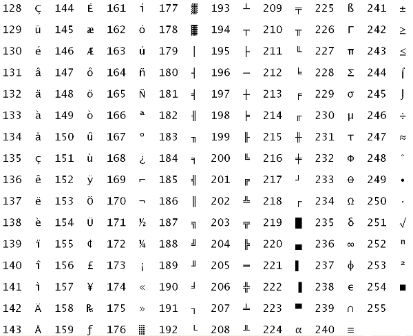

字符编码
==========

ASCII码
------------

ASCII码的取值范围是0~127，可以用7个bit表示。C语言规定 ``char`` 型占一个字节，如果存放ASCII码则只用到低7位，高位为0。以下是ASCII码表：

.. _app-encoding.asciitable:

.. table:: ASCII码表

   === == === ============================ === == === ======= === == === ==== === == === ====
   Dec Hx Oct Char                         Dec Hx Oct Char    Dec Hx Oct Char Dec Hx Oct Char
   === == === ============================ === == === ======= === == === ==== === == === ====
   0   0  0   NUL (null)                   32  20 40  (blank) 64  40 100 @    96  60 140 \`
   1   1  1   SOH (start of heading)       33  21 41  !       65  41 101 A    97  61 141 a
   2   2  2   STX (start of text)          34  22 42  "       66  42 102 B    98  62 142 b
   3   3  3   ETX (end of text)            35  23 43  #       67  43 103 C    99  63 143 c
   4   4  4   EOT (end of transmission)    36  24 44  $       68  44 104 D    100 64 144 d
   5   5  5   ENQ (enquiry)                37  25 45  %       69  45 105 E    101 65 145 e
   6   6  6   ACK (acknowledge)            38  26 46  &       70  46 106 F    102 66 146 f
   7   7  7   BEL (bell)                   39  27 47  '       71  47 107 G    103 67 147 g
   8   8  10  BS  (backspace)              40  28 50  (       72  48 110 H    104 68 150 h
   9   9  11  TAB (horizontal tab)         41  29 51  )       73  49 111 I    105 69 151 i
   10  a  12  LF  (NL line feed, new line) 42  2a 52  \*      74  4a 112 J    106 6a 152 j
   11  b  13  VT  (vertical tab)           43  2b 53  \+      75  4b 113 K    107 6b 153 k
   12  c  14  FF  (NP form feed, new page) 44  2c 54  ,       76  4c 114 L    108 6c 154 l
   13  d  15  CR  (carriage return)        45  2d 55  \-      77  4d 115 M    109 6d 155 m
   14  e  16  SO  (shift out)              46  2e 56  .       78  4e 116 N    110 6e 156 n
   15  f  17  SI  (shift in)               47  2f 57  /       79  4f 117 O    111 6f 157 o
   16  10 20  DLE (data link escape)       48  30 60  0       80  50 120 P    112 70 160 p
   17  11 21  DC1 (device control 1)       49  31 61  1       81  51 121 Q    113 71 161 q
   18  12 22  DC2 (device control 2)       50  32 62  2       82  52 122 R    114 72 162 r
   19  13 23  DC3 (device control 3)       51  33 63  3       83  53 123 S    115 73 163 s
   20  14 24  DC4 (device control 4)       52  34 64  4       84  54 124 T    116 74 164 t
   21  15 25  NAK (negative acknowledge)   53  35 65  5       85  55 125 U    117 75 165 u
   22  16 26  SYN (synchronous idle)       54  36 66  6       86  56 126 V    118 76 166 v
   23  17 27  ETB (end of trans. block)    55  37 67  7       87  57 127 W    119 77 167 w
   24  18 30  CAN (cancel)                 56  38 70  8       88  58 130 X    120 78 170 x
   25  19 31  EM  (end of medium)          57  39 71  9       89  59 131 Y    121 79 171 y
   26  1a 32  SUB (substitute)             58  3a 72  :       90  5a 132 Z    122 7a 172 z
   27  1b 33  ESC (escape)                 59  3b 73  ;       91  5b 133 [    123 7b 173 {
   28  1c 34  FS  (file separator)         60  3c 74  <       92  5c 134 \\   124 7c 174 \|
   29  1d 35  GS  (group separator)        61  3d 75  =       93  5d 135 ]    125 7d 175 }
   30  1e 36  RS  (recored separator)      62  3e 76  >       94  5e 136 ^    126 7e 176 ~
   31  1f 37  US  (unit separator)         63  3f 77  ?       95  5f 137 _    127 7f 177 DEL
   === == === ============================ === == === ======= === == === ==== === == === ====

.. index:: k扩展ASCII码, Extended ASCII

绝大多数计算机的一个字节是8位，取值范围是0~255，而ASCII码并没有规定编号为128~255的字符，为了能用一个字节表示更多的字符，各厂商制定了很多种ASCII码的扩展规范。注意，虽然通常把这些规范称为扩展ASCII码（Extended ASCII），但其实它们并不属于ASCII码标准。例如下面这种扩展ASCII码由IBM制定，在字符终端下被广泛采用，其中包含了很多表格边线字符用来画界面。

   IBM的扩展ASCII码表

.. index:: ISO-8859-1, Latin-1

在图形界面下最广泛使用的扩展ASCII码是ISO-8859-1，也称为Latin-1，其中包含欧洲各国语言中最常用的非英文字母，但毕竟只扩展了128个字符，一些不常用的字母就没有包含进来。如下表所示。

.. table:: ISO-8859-1

   === = === = === = === = === = === =
   160   176 ° 192 À 208 Ð 224 à 240 ð 
   161 ¡ 177 ± 193 Á 209 Ñ 225 á 241 ñ 
   162 ¢ 178 ² 194 Â 210 Ò 226 â 242 ò 
   163 £ 179 ³ 195 Ã 211 Ó 227 ã 243 ó 
   164 ¤ 180 ´ 196 Ä 212 Ô 228 ä 244 ô 
   165 ¥ 181 µ 197 Å 213 Õ 229 å 245 õ 
   166 ¦ 182 ¶ 198 Æ 214 Ö 230 æ 246 ö 
   167 § 183 · 199 Ç 215 × 231 ç 247 ÷ 
   168 ¨ 184 ¸ 200 È 216 Ø 232 è 248 ø 
   169 © 185 ¹ 201 É 217 Ù 233 é 249 ù 
   170 ª 186 º 202 Ê 218 Ú 234 ê 250 ú 
   171 « 187 » 203 Ë 219 Û 235 ë 251 û 
   172 ¬ 188 ¼ 204 Ì 220 Ü 236 ì 252 ü 
   173 ­ 189 ½ 205 Í 221 Ý 237 í 253 ý 
   174 ® 190 ¾ 206 Î 222 Þ 238 î 254 þ 
   175 ¯ 191 ¿ 207 Ï 223 ß 239 ï 255 ÿ 
   === = === = === = === = === = === =

编号128~159的是一些控制字符，在上表中没有列出。

Unicode和UTF-8
------------------------

.. index:: ISO 10646, UCS, Universal Character Set, p平面, Plane, BMP, Basic Multilingual Plane, Plane 0, Unicode

为了在一套编码中涵盖全世界各国语言文字和专业领域符号（例如数学符号、乐谱符号），ISO制定了ISO 10646标准，也称为UCS（Universal Character Set）。UCS编码的长度是31位，可以表示2\ :sup:`31` 个字符。如果两个字符编码的高位相同，只有低16位不同，则它们属于同一个平面（Plane），所以一个平面由2\ :sup:`16` 个字符组成。目前绝大多数常用字符都位于第一个平面（编码范围是0x0000~0xFFFF），称为BMP（Basic Multilingual Plane）或Plane 0，为了向后兼容，其中编号为0~256的字符和ASCII码以及Latin-1相同。UCS编码通常用U-xxxxxxxx这种形式表示，而BMP的编码通常用U+xxxx这种形式表示，其中x是十六进制数字。在ISO制定UCS的同时，另一个厂商联合组织也在着手制定这样的编码，称为Unicode，后来两家联手制定统一的编码，但各自发布各自的标准文档，所以UCS编码和Unicode码是相同的。

.. index:: UCS-4, UTF-32, UTF, Unicode Transformation Format, UCS-2, UTF-16, Surrogate Pair

有了字符编码，另一个问题就是这样的编码在计算机中怎么表示。现在已经不可能用一个字节表示一个字符了，最直接的想法就是用四个字节表示一个字符，这种表示方法称为UCS-4或UTF-32，UTF是Unicode Transformation Format的缩写。这样表示显然比较浪费存储空间，如果表示BMP字符，4个字节中的两个高位字节都是0，如果表示ASCII或Latin-1字符，4个字节中的3个高位字节都是0，而我们常用的绝大多数字符都在BMP、ASCII或Latin-1字符集中。另一种比较节省存储空间的办法是用两个字节表示一个字符，称为UCS-2或UTF-16，这样只能表示BMP中的字符，但BMP中有一些控制字符用于扩展，可以用两个这样的控制字符表示其他平面的字符，称为Surrogate Pair。

无论是UTF-32还是UTF-16都有一个更严重的问题就是和C语言不兼容，在C语言中字节0表示字符串结尾，库函数 ``strlen`` 、 ``strcpy`` 等等都依赖于这一点，如果字符串用UTF-32或UTF-16存储，其中有很多字节0并不表示字符串结尾，那就乱套了。

.. index:: UTF-8

UNIX之父Ken Thompson提出的UTF-8编码很好地解决了这个问题，因此得到广泛应用。和UTF-16、UTF-32不同的是，UTF-8编码的长度不固定，每个字符用1~6个字节表示。UTF-8编码具有以下性质：

*  编码为U+0000~U+007F的字符只占一个字节，就是0x00~0x7F，和ASCII码兼容。
*  编码大于U+007F的字符用2~6个字节表示，每个字节的最高位都是1，而所有ASCII码的最高位都是0，因此非ASCII码字符的UTF-8编码中不会出现ASCII码的字节（也不会出现字节0）。
*  在非ASCII码字符的多字节编码中，第一个字节的取值范围是0xC0~0xFD，根据第一个字节可以判断后面还有几个字节也属于当前字符的编码，后面每个字节的取值范围都是0x80~0xBF，详见下面的编码格式。
*  所有Unicode字符（共231个）都可以用UTF-8编码表示出来。
*  UTF-8编码最长6个字节，BMP字符的UTF-8编码最长三个字节。
*  0xFE和0xFF这两个字节在UTF-8编码中不会出现。

具体来说，UTF-8编码有以下几种格式::

   U-00000000 – U-0000007F: 0xxxxxxx
   U-00000080 – U-000007FF: 110xxxxx 10xxxxxx
   U-00000800 – U-0000FFFF: 1110xxxx 10xxxxxx 10xxxxxx
   U-00010000 – U-001FFFFF: 11110xxx 10xxxxxx 10xxxxxx 10xxxxxx
   U-00200000 – U-03FFFFFF: 111110xx 10xxxxxx 10xxxxxx 10xxxxxx 10xxxxxx
   U-04000000 – U-7FFFFFFF: 1111110x 10xxxxxx 10xxxxxx 10xxxxxx 10xxxxxx 10xxxxxx

*  ASCII码字符的UTF-8编码只有一个字节（就是ASCII码本身），最高位是0。
*  非ASCII码字符的第一个字节最高位是1，并且后面至少还要跟一个1，最高位后面跟几个1就表示后面还有几个字节也属于当前字符的编码，例如111110xx，最高位后面跟4个1，表示后面还有4个字节也属于当前字符的编码。
*  后面每个字节的最高两位都是10，而第一个字节的最高两位要么是0x，要么是11，因此可以和后面的字节区分开。这样的设计有利于误码同步，例如在网络传输过程中丢失了几个字节，很容易判断当前字符是不完整的，也很容易找到下一个字符应该从哪开始，顶多丢掉一两个字符就可以同步了，而不会导致后面的解码过程全部错乱。
*  上面的格式中标为x的位就是字符的Unicode码，最后一种6字节的格式中x位有31个，可以表示31位的Unicode码。UTF-8编码就像一列火车，第一个字节是车头，后面每个字节是车厢，其中承载的货物是Unicode码。UTF-8规定承载的Unicode码以大端表示，就是说第一个字节中的x位是Unicode码的高位，后面字节中的x位是Unicode码的低位。
*  UTF-8规定每个字符必须用尽可能少的字节来编码，换句话说，在符合编码格式的前提下，Unicode码从最高位开始的0位要尽可能少。

举例来说，U+00A9（©字符）的二进制是10101001，编码成UTF-8是11000010 10101001（0xC2 0xA9），但不能编码成11100000 10000010 10101001。

在Linux C编程中使用Unicode和UTF-8
--------------------------------------

目前各种Linux发行版都支持UTF-8编码，在磁盘上保存一个含有非ASCII字符的文本文件，默认是以UTF-8编码的。当前系统的字符编码设置可以用 :command:`locale` 命令查看::

   $ locale
   LANG=en_US.UTF-8
   LANGUAGE=
   LC_CTYPE="en_US.UTF-8"
   LC_NUMERIC="en_US.UTF-8"
   LC_TIME="en_US.UTF-8"
   LC_COLLATE="en_US.UTF-8"
   LC_MONETARY="en_US.UTF-8"
   LC_MESSAGES="en_US.UTF-8"
   LC_PAPER="en_US.UTF-8"
   LC_NAME="en_US.UTF-8"
   LC_ADDRESS="en_US.UTF-8"
   LC_TELEPHONE="en_US.UTF-8"
   LC_MEASUREMENT="en_US.UTF-8"
   LC_IDENTIFICATION="en_US.UTF-8"
   LC_ALL=

.. index:: Locale

Locale定义了语言、字符编码、日期时间格式、数字格式、货币格式等参数，详见 :manpage:`locale(1)` 、 :manpage:`locale(5)` 、 :manpage:`locale(7)` 。 :command:`locale` 命令列出的这些参数每一个都可以用环境变量单独设置，但通常这些参数的取值是一致的。在我的系统中只设置了环境变量 ``LANG`` ，其他参数没有设置，用 :command:`locale` 命令可以看到其他Locale参数也继承了环境变量 ``LANG`` 的值。

常用汉字都位于BMP中，所以一个汉字的UTF-8编码通常是3个字节。例如编辑一个C程序：

.. code-block:: c
   :linenos:

   #include <stdio.h>

   int main(void)
   {
           printf("你好\n");
           return 0;
   }

源文件是以UTF-8编码存储的::

   $ hexdump -C nihao.c 
   00000000  23 69 6e 63 6c 75 64 65  20 3c 73 74 64 69 6f 2e  |#include <stdio.|
   00000010  68 3e 0a 0a 69 6e 74 20  6d 61 69 6e 28 76 6f 69  |h>..int main(voi|
   00000020  64 29 0a 7b 0a 09 70 72  69 6e 74 66 28 22 e4 bd  |d).{..printf("..|
   00000030  a0 e5 a5 bd 5c 6e 22 29  3b 0a 09 72 65 74 75 72  |....\n");..retur|
   00000040  6e 20 30 3b 0a 7d 0a                              |n 0;.}.|
   00000047

.. index:: Multibyte Character

其中 ``e4 bd a0`` 这三个字节就是“你”的UTF-8编码， ``e5 a5 bd`` 这三个字节就是“好”的UTF-8编码。把它编译成目标文件，"你好\n"这个字符串就成了这样一串字节： ``e4 bd a0 e5 a5 bd 0a 00`` ，转义序列由两个字节变成一个字节，字符串末尾添了一个字节0，而汉字仍然占3个字节，在C标准中多字节编码的字符称为Multibyte Character。运行这个程序会把这一串字节输出到当前终端设备，如果当前终端能够识别UTF-8编码（比如图形界面的终端窗口）就能打印出汉字，如果不能识别UTF-8编码（比如一般的字符终端）就打印不出汉字。也就是说，在这个程序中识别汉字的工作既不是由C编译器做的也不是由 ``printf`` 函数做的，C编译器原封不动地把源文件中的UTF-8编码复制到目标文件中， ``printf`` 函数再把这一串字节当作以Null结尾的字符串原封不动地输出到终端设备，识别汉字的工作是由终端设备做的。

.. index:: Wide Character

仅有这种程度的汉字支持是不够的，有时候我们需要在C程序中操作字符串里的字符，比如求字符串"你好\n"中有几个汉字或字符，用 ``strlen`` 就不灵了，因为 ``strlen`` 求的是字节数而不是字符数。为了在程序中操作Unicode字符，C标准定义了宽字符（Wide Character）类型 ``wchar_t`` （使用这个类型名需包含头文件 :file:`wchar.h` ）。在字符常量或字符串字面值前面加一个 ``L`` 就表示宽字符常量或宽字符串，例如定义 ``wchar_t c = L'你';`` ，变量 ``c`` 的值就是汉字“你”的31位Unicode码，而 ``L"你好\n"`` 就相当于数组 ``wchar_t str[] = { L'你', L'好', L'\n', 0 };`` 。C标准还定义了一些操作宽字符串的库函数，例如 ``wcslen`` 函数可以取宽字符串中的字符个数。

注意Wide Character和Multibyte Character这两个概念的区别：

#. C标准没有规定Wide Character和Multibyte Character应该采用什么编码，但目前各种Linux发行版的Wide Character都采用Unicode码，Multibyte Character都采用UTF-8编码。
#. 每个Wide Character有固定的长度，用 ``wchar_t`` 类型来表示。而每个Multibyte Character的长度不固定，没有规定一种类型来表示Multibyte Character。
#. Wide Character中可能包含字节0，所以不能保存在普通的以Null结尾的字符串中，而必须保存在宽字符串中。而Multibyte Character中除了Null字符外不允许出现字节0，因此可以保存在以Null结尾的字符串中。
#. Wide Character适合做字符运算，比如统计字符数，而Multibyte Character适合做存储和传输，存储时比较节省空间，传输时有较好的容错性。

看下面的例子：

.. code-block:: c
   :linenos:

   #include <stdio.h>
   #include <locale.h>

   int main(void)
   {
           if (!setlocale(LC_CTYPE, "")) {
                   fprintf(stderr, "Can't set the specified locale! "
                           "Check LC_ALL, LC_CTYPE, LANG.\n");
                   return 1;
           }
           printf("%ls", L"你好\n");
           return 0;
   }

宽字符串 ``L"你好\n"`` 在源代码中当然还是UTF-8编码，但编译器会把它转换成4个Unicode码 ``0x00004f60 0x0000597d 0x0000000a 0x00000000`` 保存到目标文件中，按小端存储就是 ``60 4f 00 00 7d 59 00 00 0a 00 00 00 00 00 00 00`` ，用 ``hexdump`` 命令查看目标文件可以找到这些字节。

``printf`` 的转换说明 ``%ls`` 表示把后面的参数按宽字符串解释，不是见到字节0就结束，而是见到Null字符的Unicode码（4个字节0）才结束，但输出到终端仍然要以Multibyte Character编码输出，这样终端设备才能识别，所以 ``printf`` 函数先把宽字符串转换成UTF-8编码的Multibyte Character字符串再输出到终端。我们把输出重定向到文件会看得更清楚::

   $ gcc main.c
   $ ./a.out > foo
   $ hexdump -C foo
   00000000  e4 bd a0 e5 a5 bd 0a                              |.......|
   00000007

最后解释一下 :manpage:`setlocale(3)` 函数：

#. 虽然当前系统的Locale设置是 ``"en_US.UTF-8"`` ，但C程序在启动时各种Locale参数都设置成默认值 ``"C"`` ，并不继承当前系统的Locale设置。这样规定是为了代码的可移植性，如果一个C程序不调用 ``setlocale`` 函数，那么它不管在什么系统上运行，其各种Locale参数都是 ``"C"`` ，其中 ``LC_CTYPE`` 参数是 ``"C"`` 表示采用ASCII字符集。
#. 我们调用 ``setlocale`` 传的第一个参数是 ``LC_CTYPE`` ，它在C语言中被定义成一个整数常量，第二个参数是设置给它的值。如果第二个参数是空字符串 ``""`` ，则表示采用当前系统的Locale设置， ``setlocale`` 函数依次查找环境变量 ``LC_ALL`` 、 ``LC_CTYPE`` 和 ``LANG`` ，找到第一个有定义的环境变量就用它的值来设置 ``LC_CTYPE`` 。因此，调用 ``setlocale`` 函数后 ``LC_CTYPE`` 参数的值变成了 ``"en_US.UTF-8"`` 。
#. ``LC_CTYPE`` 参数影响C语言对宽字符和宽字符串的处理，正因为我们通过这个参数设置了UTF-8编码， ``printf`` 函数才会把宽字符串转换成UTF-8编码的Multibyte Character字符串再输出到终端。上面的程序如果去掉 ``setlocale`` 调用， ``LC_CTYPE`` 参数的值默认是 ``"C"`` （采用ASCII字符集），则无法打印出“你好”，因为这两个字符不属于ASCII字符集。

关于Unicode和UTF-8本节只介绍了最基本的概念，部分内容出自 [UnicodeFAQ]_ ，读者可进一步参考这篇文章。
