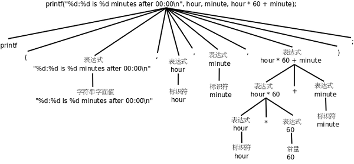

常量、变量和表达式
=======================

.. _expr.helloworld:

继续Hello World
-------------------

在 :ref:`intro.firstprogram` 中，读者应该已经尝试对Hello world程序做各种改动看编译运行结果，其中有些改动会导致编译出错，有些改动会影响程序的输出，有些改动则没有任何影响。本节我们仍以Hello world程序为例介绍一些基本的语法规则。

首先，注释可以跨行，也可以穿插在程序之中，看下面的例子。

.. code-block:: c
   :linenos:

   #include <stdio.h>

   /* 
    * comment1
    * main: generate some simple output
    */

   int main(void)
   {
           printf(/* comment2 */"Hello, world.\n"); /* comment3 */
           return 0;
   }

.. index:: j界定符, Delimiter, *号, Asterisk, p编码风格, Coding Style

第一个注释跨了四行，头尾两行是注释的界定符（Delimiter） ``/*`` 和 ``*/`` ，中间两行开头的*号（Asterisk）并没有特殊含义，只是为了看起来整齐，这不是语法规则而是大家都遵守的C编码风格（Coding Style）之一，编码风格将在 :doc:`codingstyle` 详细介绍。

使用注释需要注意两点：

.. index:: q嵌套, Nest, /斜线, Slash

#. 注释不能嵌套（Nest）使用，就是说一个注释的文字中不能再出现 ``/*`` 和 ``*/`` 了，例如 ``/* text1 /* text2 */ text3 */`` 是错误的，编译器只把 ``/* text1 /* text2 */`` 看成注释，后面的 ``text3 */`` 无法解析，因而会报错。
#. 有的C代码中有类似 ``// comment`` 的注释，两个/斜线（Slash）表示从这里直到该行末尾的所有字符都属于注释，这种注释不能跨行，也不能穿插在一行代码中间。这是从C++借鉴的语法，在C99中被标准化。

.. index:: x向后兼容性, Backward Compatibility, Old Style C, C89, C99, m美国国家标准委员会, ANSI, American National Standards Institute

.. note:: C语言标准

   C语言的发展历史大致上分为三个阶段：Old Style C、C89和C99。Ken Thompson和Dennis Ritchie最初发明C语言时有很多语法和现在最常用的写法并不一样，但为了向后兼容性（Backward Compatibility），这些语法仍然在C89和C99中保留下来了，本书不详细讲Old Style C，但在必要的地方会加以说明。C89是最早的C语言规范，于1989年提出，1990年首先由ANSI（美国国家标准委员会，American National Standards Institute）推出，后来被采纳为ISO国际标准（ISO/IEC 9899:1990），因而有时也称为C90，最经典的C语言教材 [K&R]_ 就是基于这个版本的，C89是目前最广泛采用的C语言标准，大多数编译器都完全支持C89。C99标准（ISO/IEC 9899:1999）是在1999年推出的，加入了许多新特性，但目前仍没有得到广泛支持，在C99推出之后相当长的一段时间里，连 :command:`gcc` 也没有完全实现C99的所有特性。C99标准详见 [C99]_ 。本书讲C的语法以C99为准，但示例代码通常只使用C89语法，很少使用C99的新特性。

   C标准的目的是为了精确定义C语言，而不是为了教别人怎么编程，C标准在表达上追求准确和无歧义，却十分不容易看懂， [StandardC]_ 和 [StandardCLibrary]_ 是对C89及其修订版本的阐释（可惜作者没有随C99更新这两本书），比C标准更容易看懂，另外，参考 [C99Rationale]_ 也有助于加深对C标准的理解。

.. index:: z字符串字面值, z字符串, String Literal, z转义序列, Escape Sequence

像 ``"Hello, world.\n"`` 这种由双引号引起来的一串字符称为字符串字面值（String Literal），或者简称字符串。注意，程序的运行结果并没有双引号， ``printf`` 打印出来的只是里面的一串字符 ``Hello, world.`` ，因此双引号是字符串字面值的界定符，夹在双引号中间的一串字符才是它的内容。注意，打印出来的结果也没有 ``\n`` 这两个字符，这是为什么呢？在 :ref:`intro.naturalformallang` 中提到过，C语言规定了一些转义序列（Escape Sequence），这里的 ``\n`` 并不表示它的字面意思，也就是说并不表示\\和n这两个字符本身，而是合起来表示一个换行符。例如我们写三条打印语句：

.. code-block:: c
   :linenos:

   printf("Hello, world.\n");
   printf("Goodbye, ");
   printf("cruel world!\n");

运行的结果是第一条语句单独打印到第一行，后两条语句则依次打印到第二行。为了节省篇幅突出重点，以后的例子通常省略 ``#include`` 和 ``int main(void) { ... }`` 这些Boilerplate，但读者在练习时需要加上这些构成一个完整的程序才能编译通过。

C标准规定的转义字符有以下几种：

.. index:: '引号, Single Quote, Apostrophe, "引号, Double Quote, ?号, Question Mark, \反斜线, Backslash, Alert, Bell, t退格, Backspace, f分页符, Form Feed, h换行符, Line Feed, h回车, Carriage Return, s水平制表符, Horizontal Tab, c垂直制表符, Vertical Tab

.. _expr.escapesequence:

.. table:: C标准规定的转义字符

   ===     ======================================
   \\'      '引号（Single Quote或Apostrophe）
   \\"      "引号（Double Quote）
   \\?      ?号（Question Mark）
   \\\      \反斜线（Backslash）
   \\a      响铃（Alert或Bell）
   \\b      退格（Backspace）
   \\f      分页符（Form Feed）
   \\n      换行符（Line Feed）
   \\r      回车（Carriage Return）
   \\t      水平制表符（Horizontal Tab）
   \\v      垂直制表符（Vertical Tab）
   ===     ======================================

如果在字符串字面值中要表示单引号和问号，既可以使用转义序列 ``\'`` 和 ``\?`` ，也可以直接用字符'和?，而要表示\\或"则必须使用转义序列，因为\\字符表示转义而不表示它的字面含义，"表示字符串的界定符而不表示它的字面含义。可见转义序列有两个作用：一是把普通字符转义成特殊字符，例如把字母n转义成换行符；二是把特殊字符转义成普通字符，例如\\和"是特殊字符，转义后取它的字面值。

.. index:: z制表符, Tab

C语言规定了几个控制字符，不能用键盘直接输入，因此采用\\加字母的转义序列表示。 ``\a`` 是响铃字符，在字符终端下显示这个字符的效果是PC喇叭发出嘀的一声，在图形界面终端下的输出效果取决于终端的配置。在终端下显示 ``\b`` 和按下退格键的效果相同。 ``\f`` 是分页符，主要用于控制打印机在打印源代码时提前分页，这样可以避免一个函数跨两页打印。 ``\n`` 和 ``\r`` 分别表示Line Feed和Carriage Return，这两个词来自老式的英文打字机，Line Feed是跳到下一行（进纸，喂纸，有个喂的动作所以是feed），Carriage Return是回到本行开头（Carriage是卷着纸的轴，随着打字慢慢左移，打完一行就一下子移回最右边，如果你看过欧美的老电影应该能想起来这是什么）。用老式打字机打完一行之后需要这么两个动作， ``\r\n`` ，所以现在Windows平台的文本文件用 ``\r\n`` 做换行符，许多应用层网络协议（如HTTP）也用 ``\r\n`` 做换行符，而Linux和各种UNIX平台的文本文件只用 ``\n`` 做换行符。在终端下显示 ``\t`` 和按下Tab键的效果相同，用于在终端下定位到表格的下一列， ``\v`` 用于在终端下定位到表格的下一行。 ``\v`` 比较少用， ``\t`` 比较常用，以后将“水平制表符”简称为“制表符”或Tab。请读者用 ``printf`` 语句试试这几个控制字符的作用。

注意 ``"Goodbye, "`` 末尾的空格，字符串字面值中的空格也算一个字符，也会出现在输出结果中，而程序中别处的空格和Tab多一个少一个往往是无关紧要的，不会对编译结果产生任何影响，例如不缩进不会影响程序的结果， ``main`` 后面多几个空格也没影响，但是 ``int`` 和 ``main`` 之间至少要有一个空格分隔开：

.. code-block:: c
   :linenos:

   int main    (void)
   {
   printf("Hello, world.\n");
   return 0;
   }

不仅空格和Tab是无关紧要的，换行也是如此，我甚至可以把整个程序写成一行（但 ``include`` 必须单独占一行）：

.. code-block:: c
   :linenos:

   #include<stdio.h>
   int main(void){printf("Hello, world.\n");return 0;}

这样也行，但肯定不是好的代码风格，去掉缩进已经很影响可读性了，写成现在这个样子可读性更差。 **好的代码风格要求缩进整齐，每个语句一行，适当留空行。**

常量
--------

.. index:: c常量, Constant, z字符常量, Character Constant, z整数, Integer, f浮点数, Floating Point

常量（Constant）是程序中最基本的元素，有字符常量（Character Constant）、整数（Integer）常量、浮点数（Floating Point）常量和枚举常量。枚举常量将在 :ref:`struct.typetag` 介绍。下面看一个例子：

.. code-block:: c
   :linenos:

   printf("character: %c\ninteger: %d\nfloating point: %f\n", '}', 34, 3.14);

字符常量要用单引号括起来，例如上面的 ``'}'`` ，注意单引号只能括一个字符而不能像双引号那样括一串字符，字符常量也可以是一个转义序列，例如 ``'\n'`` ，这时虽然单引号括了两个字符，但实际上只表示一个字符。和字符串字面值中使用转义序列有一点区别，如果在字符常量中要表示双引号"和问号?，既可以使用转义序列 ``\"`` 和 ``\?`` ，也可以直接用字符"和?，而要表示'和\\则必须使用转义序列。[#]_

.. index:: s三连符, Trigraph

.. [#] 读者可能会奇怪，为什么需要规定一个转义序列 ``\?`` 呢？因为C语言规定了一些三连符（Trigraph），在某些特殊的终端上缺少某些字符，需要用Trigraph输入，例如用 ``??=`` 表示#字符。Trigraph极不常用，极不常用的C语法在本书中通常不会介绍，介绍这个只是为了让读者理解转义序列的作用，即特殊字符转普通字符，普通字符转特殊字符。?号也是一种特殊字符，要表示其字面意思也需要用转义序列，但如果?号单独出现，不会被误认为是三连符，因而也可以不用转义序列。

.. index:: l类型, Type

在计算机中整数和小数的内部表示方式不同（将在 :doc:`number` 详细介绍），因而在C语言中是两种不同的类型（Type），通常小数在计算机中的表示方式称为浮点数，详见 :ref:`number.float` 。上例的34和3.14分别是整数常量和浮点数常量。

上例的 ``printf`` 语句输出结果和 ``Hello world`` 那个例子不太一样，字符串 ``"character: %c\ninteger: %d\nfloating point: %f\n"`` 并不是按原样打印输出的，而是输出成这样::

  character: }
  integer: 34
  floating point: 3.140000

.. index:: g格式化字符串, Format String, %号, Percent Sign, z转换说明, Conversion Specification, z占位符, Placeholder

``printf`` 中的第一个字符串称为格式化字符串（Format String），它规定了后面几个常量以何种格式插入到这个字符串中，在格式化字符串中%号（Percent Sign）后面加上字母c、d、f分别表示字符型、整型和浮点型的转换说明（Conversion Specification），转换说明只在格式化字符串中占个位置，并不出现在最终的打印结果中，这种用法通常叫做占位符（Placeholder）。这也是一种字面意思与真实意思不同的情况，但是转换说明和转义序列又有区别， **转义序列是编译时处理的，而转换说明是在运行时由printf函数处理的** ：

#. 源文件中的字符串字面值是 ``"character: %c\ninteger: %d\nfloating point: %f\n"`` ， ``\n`` 占两个字符。
#. 编译之后保存在可执行文件中的字符串是 ``character： %c换行integer: %d换行floating point: %f换行`` ， ``\n`` 已经被替换成一个换行符，而 ``%c`` 这两个字符不变。
#. 在运行时这个字符串被传给 ``printf`` ， ``printf`` 再把其中的 ``%c`` 、 ``%d`` 、 ``%f`` 解释成转换说明。

有时候不同类型的数据很容易弄混，例如 ``"5"`` 、 ``'5'`` 、 ``5`` ，如果你注意了它们的界定符就会很清楚，第一个是字符串字面值，第二个是字符，第三个是整数，看了本章后面几节你就知道为什么一定要严格区分它们之间的差别了。

.. rubric:: 习题

#. 我们知道，用\\斜线表示转义序列和在 ``printf`` 格式化字符串中用%号表示占位符是两种不同的机制，前者在编译时处理，后者在运行时处理。但两者在语法上具有类似的规律，想想在 ``printf`` 的格式化字符串中怎么表示一个%字符？写个小程序试验一下。

.. _expr.variable:

变量
-----------

.. index:: b变量, Variable, z值, Value

变量（Variable）是编程语言最重要的概念之一，在程序中变量是一个名字，而这个名字代表的是计算机存储器中的一块空间，可以在里面保存一个值（Value），保存的值是可以随时变的，比如这次存个字符 ``'a'`` ，变量的值就是 ``'a'`` ，下次存个字符 ``'b'`` ，变量的值就变成 ``'b'`` ，正因为变量的值可以随时变所以才叫变量。

.. index:: s声明, Declaration

常量有不同的类型，变量也有不同的类型，变量的类型决定了它所占的存储空间的大小。在C语言中用声明（Declaration）来规定变量的名字和类型，例如下面有四条声明，规定了四个变量 ``fred`` 、 ``bob`` 、 ``jimmy`` 和 ``tom`` 的类型分别是字符型、整型、单精度浮点型、双精度浮点型：

.. code-block:: c
   :linenos:

   char fred;
   int bob;
   float jimmy;
   double tom;

.. index:: d定义, Definition

.. _expr.declaration:

.. note:: 声明和定义

   C语言中的声明有变量声明、函数声明和类型声明三种。本节只讲变量声明，下一章会讲到函数声明，从 :doc:`struct` 开始我们会看到类型声明。

   从另一个角度来看，声明分为“是定义（Definition）的声明”和“不是定义的声明”，那么什么样的声明同时也是定义呢？简单地说， **分配存储空间的声明同时也是定义，不分配存储空间的声明不是定义** 。具体来说：

   *  如果一个变量声明要求程序在运行时为该变量分配存储空间，那么这个声明同时也是变量的定义。本章和接下来几章的示例代码中的变量声明都是要分配存储空间的，因而都是定义；等学到 :ref:`link.declaration` 我们会看到有些变量声明不分配存储空间，因而不是定义。
   *  如果一个函数声明带有函数体，要求编译器为它生成指令（当然在运行时也需要分配存储空间来存放这些指令），那么这个声明同时也是函数的定义。在下一章我们会看到带函数体的声明和不带函数体的声明，不带函数体的声明不是函数定义。
   *  类型声明总是不分配存储空间的，所以严格来说只有类型声明而没有类型定义，但通常我们习惯说“定义了某种类型”，所以在本书中“类型定义”和“类型声明”表示相同的含义，不加区分。

   变量声明也是以;号结尾的，这一点和语句类似，但是在语法上变量声明和语句是有区别的，语句只能出现在函数体中，而变量声明既可以出现在函数体中也可以出现在所有函数之外。

浮点型有三种， ``float`` 是单精度浮点型， ``double`` 是双精度浮点型， ``long double`` 是精度更高的浮点型。它们之间的区别和转换规则将在 :doc:`type` 详细介绍，在随后的几章中我们只使用 ``double`` 类型，上一节介绍的常量3.14是 ``double`` 类型的常量， ``printf`` 的 ``%f`` 也是 ``double`` 型的转换说明（注意 ``%f`` 不是 ``float`` 型的转换说明）。给变量起名不能太随意，上面四个变量的名字就不够好，我们猜不出这些变量是用来存什么的，像下面这样起名就比较有意义：

.. code-block:: c
   :linenos:

   char firstletter;
   char lastletter;
   int hour, minute;

在这个例子中我们还看到两个相同类型的变量（同样是 ``int`` 类型的 ``hour`` 和 ``minute`` ）可以一起声明。

.. index:: _下划线, Underscore, b标识符, Identifier

给变量起名有一定的限制，C语言规定必须以字母或下划线（Underscore）开头，后面可以跟若干个字母、数字、下划线，但不能有其他字符。例如这些是合法的变量名： ``Abc`` 、 ``__abc__`` 、 ``_123`` 。但这些是不合法的变量名： ``3abc`` 、 ``ab$`` 。其实这条规则不仅适用于变量名，也适用于所有可以由程序员起名的语法元素，例如以后要讲的函数名、宏定义、结构体成员名等，在C语言中这些统称为标识符（Identifier）。

.. index:: g关键字, Keyword, b保留字, Reserved Word, g高亮显示, Highlight

另外要注意，表示类型的 ``char`` 、 ``int`` 、 ``float`` 、 ``double`` 等虽然符合上述规则，但也不能用作标识符。在C语言中有些单词有特殊意义，不允许用作标识符，这些单词称为关键字（Keyword）或保留字（Reserved Word）。通常用于编程的文本编辑器都会高亮显示（Highlight）这些关键字，所以只要小心一点通常不会误用作标识符。C99规定的关键字有::

   auto  break  case  char  const  continue  default  do  double
   else  enum  extern  float  for  goto  if  inline  int  long
   register  restrict  return  short  signed  sizeof  static  struct  switch  typedef
   union  unsigned  void  volatile  while  _Bool  _Complex  _Imaginary

还有一点要注意， **一般来说应避免使用以下划线开头的标识符** ，以下划线开头的标识符只要不和C语言关键字冲突的都是合法的，但是往往被编译器用作一些功能扩展（比如 :ref:`asmc.structunion` 讲到 :command:`gcc` 的 ``__attribute__`` 语法），C标准库也定义了很多以下划线开头的标识符留作内部使用，所以除非你对编译器的特性和C标准库的实现特别清楚，一般应避免使用这种标识符，以免造成命名冲突。

.. index:: Best Practice

请记住： **理解一个概念不是把定义背下来就行了，一定要理解它的外延和内涵，也就是什么情况属于这个概念，什么情况不属于这个概念，什么情况虽然属于这个概念但一般推荐的做法（Best Practice）是要尽量避免这种情况，这才算是真正理解了。**

赋值
--------

.. index:: f赋值, Assignment

定义了变量之后，我们要把值存到变量所表示的存储空间里，可以用赋值（Assignment）语句实现。比如下面的例子首先定义三个变量，再分别给它们赋值：

.. code-block:: c
   :linenos:

   char firstletter;
   int hour, minute;
   firstletter = 'a';   /* give firstletter the value 'a' */
   hour = 11;           /* assign the value 11 to hour */
   minute = 59;         /* set minute to 59 */

注意：

.. index:: z字节, Byte

#. 变量一定要先声明后使用，编译器必须先看到变量声明，才知道 ``firstletter`` 、 ``hour`` 和 ``minute`` 是变量名，各自代表一块存储空间。
#. 变量声明中的类型表明这个变量代表多大的一块存储空间，以及在这块存储空间里按什么格式存放数据，编译器看到变量的类型才知道生成什么样的指令来读写变量的存储空间。存储空间的单位是字节（Byte），在C语言中 ``char`` 型变量占一个字节，其他类型的变量占多少个字节在不同平台上有不同的规定，将在 :doc:`type` 详细讨论。
#. 赋值语句的作用是把等号右边的值赋给等号左边的变量。这里的等号不表示数学里的相等关系，和1+1=2的等号是不同的。在数学上不会有i=i+1这种等式成立，而在C语言中这样的赋值操作表示把变量i的存储空间中的值取出来，再加上1，得到的结果再存回i的存储空间中。再比如，在数学上a=7和7=a是一样的，而在C语言中后者是不合法的，因为7是常量，不代表存储空间也不能被赋值，因此不能出现在等号左边。

.. index:: c初始化, Initialization

变量的定义和赋值也可以一步完成，这称为变量的初始化（Initialization），例如要达到上面代码的效果也可以这样写：

.. code-block:: c
   :linenos:

   char firstletter = 'a';
   int hour = 11, minute = 59;

.. index:: Initializer

其中等号右边的值叫做Initializer，例如上面的 ``'a'`` 、 ``11`` 和 ``59`` 。注意， **初始化是一种特殊的声明，而不是一种赋值语句** 。就目前来看，先定义一个变量再给它赋值和定义这个变量的同时给它初始化所达到的效果是一样的，C语言的很多语法规则既适用于赋值也适用于初始化，但在以后的学习中你也会了解到它们之间的不同，请在学习过程中注意总结赋值和初始化的相同和不同之处。

如果在纸上“跑”一个程序 [#]_ ，可以用一个框表示变量的存储空间，在框的外边标上变量名，在框里记上它的值，如下图所示。

.. [#] 在纸上跑程序是每个初学编程的人都要练的一项基本功，你应该能自己算出程序的运行结果，从而对它的结果有一个预期，如果你自己都不知道这个程序该出什么结果，那交给计算机跑出来的结果是对是错你如何判断？

.. figure:: ../images/expr.variable.png

   在纸上表示变量

你可以用不同形状的框表示不同类型的变量，这样可以提醒你给变量赋的值必须符合它的类型。如果所赋的值和变量的类型不符会导致编译器报警告或报错（这是一种语义错误），例如：

.. code-block:: c
   :linenos:

   int hour, minute;
   hour = "Hello.";       /* WRONG ! */
   minute = "59";         /* WRONG !! */

注意最后一个语句，把 ``"59"`` 赋给 ``minute`` 看起来像是对的，但是类型不对，字符串字面值不能赋给整型变量。

既然可以为变量的存储空间赋值，就应该可以把值取出来用，现在我们取出这些变量的值用 ```printf``` 打印：

.. code-block:: c
   :linenos:

   printf("Current time is %d:%d\n", hour, minute);

变量名用在等号左边表示赋值，而用在 ``printf`` 中表示把它的存储空间中的值取出来替换在那里，就相当于 ``printf("Current time is %d:%d\n", 11, 59);`` 。

.. _expr.expression:

表达式
-------------

.. index:: y运算符, Operator, c操作数, Operand, b表达式, Expression

常量和变量都可以参与加减乘除运算，例如 ``1+1`` 、 ``hour-1`` 、 ``hour * 60 + minute`` 、 ``minute/60`` 等。这里的+ - * /称为运算符（Operator），而参与运算的常量和变量称为操作数（Operand），由运算符和操作数组成的算式称为表达式（Expression）。

.. index:: y优先级, Precedence, ()括号, Parenthesis

和数学上规定的一样， ``hour * 60 + minute`` 这个表达式应该先算乘再算加，也就是说运算符是有优先级（Precedence）的，\*和/是同一优先级，+和-是同一优先级，\*和/的优先级高于+和-，同一优先级的运算从左到右依次计算，如果不希望按默认的优先级计算则要加()括号（Parenthesis）。例如(3+4)*5/6应先算3+4，再算*5，再算/6。

前面讲过打印语句和赋值语句，现在我们定义：在任意表达式后面加个;号就构成一种语句，称为表达式语句。例如：

.. code-block:: c
   :linenos:

   hour * 60 + minute;

这是个合法的语句，但这个语句在程序中起不到任何作用，把 ``hour`` 的值和 ``minute`` 的值取出来相加和相乘，得到的计算结果却没有保存，白算了一通。再比如：

.. code-block:: c
   :linenos:

   int total_minute;
   total_minute = hour * 60 + minute;

这个语句就很有意义，把计算结果保存在另一个变量 ``total_minute`` 里。事实上等号也是一种运算符，称为赋值运算符，赋值语句也是一种表达式语句，等号的优先级比+和*都低，所以先算出等号右边的结果然后才做赋值操作，整个表达式 ``total_minute = hour * 60 + minute`` 后面加个;号构成一个语句。

**任何表达式都有值和类型两个基本属性。** ``hour * 60 + minute`` 的值是由三个 ``int`` 型的操作数计算出来的，所以这个表达式的类型也是 ``int`` 型。同理，表达式 ``total_minute = hour * 60 + minute`` 的类型也是 ``int`` ，它的值是多少呢？C语言规定等号运算符的计算结果就是等号左边被赋予的那个值，所以这个表达式的值和 ``hour * 60 + minute`` 的值相同，也和 ``total_minute`` 被赋值之后的值相同。

等号运算符还有一个和+ - * /不同的特性，如果一个表达式中出现多个等号，这些等号是从右到左依次计算的，和+ - * /正相反，例如：

.. code-block:: c
   :linenos:

   int total_minute, total;
   total = total_minute = hour * 60 + minute;

计算顺序是：

#. 计算 ``hour * 60 + minute`` 得到一个结果。
#. 计算右边的等号，就是把 ``hour * 60 + minute`` 的结果赋给变量 ``total_minute`` ，这个结果同时也是表达式 ``total_minute = hour * 60 + minute`` 的值。
#. 计算左边的等号，即把表达式 ``total_minute = hour * 60 + minute`` 的值再赋给变量 ``total`` ，这个结果同时也是整个表达式 ``total = total_minute = hour * 60 + minute`` 的值。

.. index:: j结合性, Associativity

如果一个操作数的左右两侧各有一个相同优先级的运算符，这个操作数与左边的运算符结合还是与右边的运算符结合取决于运算符的结合性（Associativity），相同优先级的运算符应该具有相同的结合性，+ -和* /是左结合的，而等号是右结合的。在上面的表达式中，操作数 ``total_minute`` 的左右两边都有等号，应该和右边的等号结合，相当于 ``total = (total_minute = hour * 60 + minute)`` ，而不是 ``(total = total_minute) = hour * 60 + minute`` 。

现在我们总结一下到目前为止学过的语法规则::

   表达式 → 标识符
   表达式 → 常量
   表达式 → 字符串字面值
   表达式 → (表达式)
   表达式 → 表达式 + 表达式
   表达式 → 表达式 - 表达式
   表达式 → 表达式 * 表达式
   表达式 → 表达式 / 表达式
   表达式 → 表达式 = 表达式
   语句 → 表达式;
   语句 → printf(表达式, 表达式, 表达式, ...);
   变量声明 → 类型 标识符 = Initializer, 标识符 = Initializer, ...; （“= Initializer”的部分是可写可不写的）

注意， **本书所列的语法规则都是简化过的，是不准确的，目的是为了便于初学者理解** ，比如上面所列的语法规则并没有描述运算符的优先级和结合性。完整的C语法规则请参考 [C99]_ 的Annex A。

表达式可以是单个的常量或变量，也可以是根据以上规则组合而成的更复杂的表达式。以前我们用 ``printf`` 打印常量或变量的值，现在可以用 ``printf`` 打印更复杂的表达式的值，例如：

.. code-block:: c
   :linenos:

   printf("%d:%d is %d minutes after 00:00\n", hour, minute, hour * 60 + minute);

编译器在翻译这条语句时，首先根据上述语法规则把这个语句解析成下图所示的语法树，然后再根据语法树生成相应的指令。



   语法树

语法树的每一步分解利用一条语法规则，直到分解成Token为止，所以语法树的末端全部是Token。语法解析的过程十分复杂，我们不深入讨论如何分解，而是反过来从组合的角度来理解语法规则。上面的打印语句是这样组合而成的：

#. ``hour`` 是标识符，根据规则“表达式 → 标识符”，它也是表达式。
#. ``60`` 是常量，根据规则“表达式 → 常量”，它也是表达式。
#. 既然 ``hour`` 和 ``60`` 都是表达式，根据规则“表达式 → 表达式 * 表达式”， ``hour * 60`` 可以组合成表达式。
#. ``minute`` 是标识符，根据规则“表达式 → 标识符”，它也是表达式。
#. 既然 ``hour * 60`` 和 ``minute`` 都是表达式，根据规则“表达式 → 表达式 + 表达式”， ``hour * 60 + minute`` 可以组合成表达式。
#. ``"%d:%d is %d minutes after 00:00\n"`` 是字符串字面值，根据规则“表达式 → 字符串字面值”，它也是表达式。
#. 既然 ``"%d:%d is %d minutes after 00:00\n"`` 是表达式， ``hour`` 是表达式， ``minute`` 是表达式， ``hour * 60 + minute`` 是表达式，根据规则“语句 → printf(表达式, 表达式, 表达式, ...);”， ``printf("%d:%d is %d minutes after 00:00\n", hour, minute, hour * 60 + minute);`` 可以组合成一个语句。

根据这些语法规则进一步组合可以写出更复杂的语句，比如在一条语句中完成计算、赋值和打印功能：

.. code-block:: c
   :linenos:

   printf("%d:%d is %d minutes after 00:00\n", hour, minute, total_minute = hour * 60 + minute);

.. index:: z组合, Composition

理解组合（Composition）规则是理解语法规则的关键所在，正因为可以根据语法规则任意组合，我们才可以用简单的常量、变量、表达式、语句和声明搭建出任意复杂的程序，以后我们学习新的语法规则时会进一步体会到这一点。注意表达式不宜过度组合，否则会给阅读和调试带来困难，上面的例子最好拆成两条语句来写：

.. code-block:: c
   :linenos:

   total_minute = hour * 60 + minute;
   printf("%d:%d is %d minutes after 00:00\n", hour, minute, total_minute);

根据语法规则组合出来的表达式在语义上并不总是正确的，例如：

.. code-block:: c
   :linenos:

   minute + 1 = hour;

.. index:: z左值, lvalue, y右值, rvalue

等号左边的表达式要求表示一个存储位置而不是一个值，这是等号运算符和+ - * /运算符的又一个显著的不同。有的表达式既可以表示一个存储位置也可以表示一个值，而有的表达式只能表示值，不能表示存储位置，例如 ``minute + 1`` 这个表达式就不能表示存储位置，放在等号左边是语义错误。表达式所表示的存储位置称为左值（lvalue），允许放在等号左边，而之前我们所说的表达式的值也称为右值（rvalue），只能放在等号右边。总之， **有的表达式既可以做左值也可以做右值，而有的表达式只能做右值** 。目前我们学过的表达式中只有变量可以做左值，以后会讲到另外几种可以做左值的表达式。

我们看一个有意思的例子，如果定义三个变量 ``int a, b, c;`` ，表达式 ``a = b = c`` 是合法的，先求 ``b = c`` 的值，再把这个值赋给 ``a`` ，而表达式 ``(a = b) = c`` 是不合法的，先求 ``(a = b)`` 的值没问题，但 ``(a = b)`` 这个表达式不能再做左值了，因此放在 ``= c`` 的等号左边是错的。

最后说说整数的除法运算，有一点特殊之处：

.. code-block:: c
   :linenos:

   hour = 11;
   minute = 59;
   printf("%d and %d hours\n", hour, minute / 60);

执行结果是 ``11 and 0 hours`` ，也就是说59/60得0，这是因为两个 ``int`` 型操作数相除的表达式仍为 ``int`` 型，只能保存计算结果的整数部分，即使小数部分是0.98也要舍去。

.. index:: Floor, Ceiling

向下取整的运算称为Floor，用数学符号⌊⌋表示；向上取整的运算称为Ceiling，用数学符号⌈⌉表示。例如::

   ⌊59/60⌋=0
   ⌈59/60⌉=1
   ⌊-59/60⌋=-1
   ⌈-59/60⌉=0

.. index:: Truncate towards Zero

在C语言中整数除法取的既不是Floor也不是Ceiling，无论操作数是正是负总是把小数部分截掉，在数轴上向零的方向取整（Truncate towards Zero），或者说当操作数为正的时候相当于Floor，当操作数为负的时候相当于Ceiling。回到先前的例子，要得到更精确的结果可以这样：

.. code-block:: c
   :linenos:

   printf("%d hours and %d percent of an hour\n", hour, minute * 100 / 60);
   printf("%d and %f hours\n", hour, minute / 60.0);

注意第二个 ``printf`` 中的表达式 ``minute / 60.0`` ， ``60.0`` 是 ``double`` 型的，/运算符要求左右两边的操作数类型一致，而现在并不一致，那怎么计算呢？C语言规定了一套隐式类型转换规则，在这里编译器自动把左边的 ``minute`` 也转成 ``double`` 型来计算，计算结果（即表达式 ``minute / 60.0`` 的值）也是 ``double`` 型的，在 ``printf`` 的格式化字符串中应该用 ``%f`` 转换说明与之对应。

本来编程语言作为一种形式语言要求有简单而严格的规则，自动类型转换规则不仅很复杂，而且使C语言的形式看起来也不那么严格了，C语言这么设计是为了书写程序简便而做的折衷，有些事情编译器可以自动做好，程序员就不必每次都写一堆繁琐的转换代码。然而C语言的类型转换规则非常难掌握，本书的前几章会尽量避免类型转换，到 :ref:`type.conversion` 再集中解决这个问题。

.. rubric:: 习题

#. 假设变量x和n是两个正整数，我们知道x/n这个表达式的结果要取Floor，例如x是17，n是4，则结果是4。如果希望结果取Ceiling（例如x是17，n是4，则结果是5；x是16，n是4，则结果是4），应该怎么写表达式呢？

.. _expr.char:

字符类型与字符编码
--------------------------

字符常量或字符型变量也可以当作整数参与运算，例如：

.. code-block:: c
   :linenos:

   printf("%c\n", 'a' + 1);

执行结果是b。

.. index:: z字符编码, Character Encoding, ASCII, American Standard Code for Information Interchange, b不可见字符, Non-printable Character, k空白字符, Whitespace

我们知道，符号在计算机内部也用数字表示，每个字符在计算机内部用一个整数表示，称为字符编码（Character Encoding），目前最常用的是ASCII码（American Standard Code for Information Interchange），详见 :ref:`app-encoding.asciitable` 。表中每一栏的最后一列是字符，前三列分别是用十进制（Dec）、十六进制（Hx）和八进制（Oct）表示的字符编码，各种进制之间的换算将在 :ref:`number.conversion` 介绍。从十进制那一列可以看出ASCII码的取值范围是0~127。表中的很多字符是不可见字符（Non-printable Character）和空白字符（Whitespace） [#]_ ，不能像字母a这样把字符本身填在表中，而是用一个名字来描述该字符，例如CR(carriage return)、LF(NL line feed，newline)、DEL等等。作为练习，请读者查一查 :ref:`expr.escapesequence` 中的字符在ASCII码表中的什么位置。

.. [#] 空白字符在不同的上下文中有不同的含义，在C语言中空白字符定义为空格、水平Tab（ ``\t`` ）、垂直Tab（ ``\v`` ）、换行（ ``\r`` 和 ``\n`` ）和分页符（ ``\f`` ），本书在使用“空白字符”这个词时会明确说明在当前上下文中空白字符指的是哪些字符。

回到刚才的例子，在ASCII码中字符a是97，字符b是98。计算 ``'a' + 1`` 这个表达式，应该按ASCII码把 ``'a'`` 当作整数值97，然后加1，得到98，根据转换说明 ``%c`` ， ``printf`` 要把98这个整数值当作ASCII码来解释，打印出相应的字符b。

.. index:: z整型, z整数类型, Integer Type

之前我们说“整型”是指 ``int`` 型，而现在我们知道 ``char`` 型本质上就是整数，只不过取值范围比 ``int`` 型小，所以 **以后我们把char型和int型统称为整数类型（Integer Type）或简称整型** ，在 :ref:`type.integer` 我们还要学习几种类型也属于整型。

字符'a'~'z'、'A'~'Z'、'0'~'9'的ASCII码都是连续的，因此表达式 ``'a' + 25`` 和 ``'z'`` 的值相等， ``'0' + 9`` 和 ``'9'`` 的值也相等。注意'0'~'9'的ASCII码是十六进制的30~39，和整数值0~9是不相等的。

.. index:: NUL字符, Null Character

字符也可以用ASCII码转义序列表示，这种转义序列由\\加上1~3个八进制数字组成，或者由\\x加上1~2个十六进制数字组成，可以用在字符常量或字符串字面值中。例如 ``'\0'`` 或 ``'\x0'`` 表示NUL字符（Null Character）， ``'\11'`` 或 ``'\x9'`` 表示Tab字符， ``"\11"`` 或 ``"\x9"`` 表示只包含一个Tab字符的字符串。注意 ``'0'`` 的ASCII码是48，而 ``'\0'`` 的ASCII码是0，两者是不同的。
