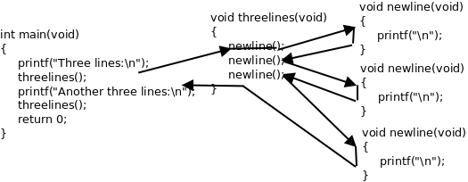

函数入门
===========

.. _func.mathfunc:

数学函数
-----------

在数学中我们用过sin和ln这样的函数，例如sin(π/2)=1，ln1=0等等，在C语言中也可以使用这些函数（数学函数sin在C标准库中就是 ``sin`` 函数，而数学函数ln在C标准库中对应的是 ``log`` 函数）：

.. code-block:: c
   :linenos:

   #include <math.h>
   #include <stdio.h>

   int main(void)
   {
           double pi = 3.1416;
           printf("sin(pi/2)=%f\nln1=%f\n", sin(pi/2), log(1.0));
           return 0;
   }

编译运行这个程序，结果如下::

   $ gcc main.c -lm
   $ ./a.out
   sin(pi/2)=1.000000
   ln1=0.000000

.. index:: h函数, Function, h函数调用, Function Call, h后缀运算符, Postfix Operator, h函数名, Function Designator, h函数类型, Function Type, f返回值, Return Value

在数学中写一个函数有时候可以省略括号，而C语言要求一定要加上括号，例如 ``log(1.0)`` 。在C语言的术语中， ``1.0`` 是参数， ``log`` 是函数（Function）， ``log(1.0)`` 是函数调用（Function Call）。 ``sin(pi/2)`` 和 ``log(1.0)`` 这两个函数调用在我们的 ``printf`` 语句中处于什么位置呢？在上一章讲过，这应该是写表达式的位置，因此函数调用也是一种表达式。 ``log(1.0)`` 这个表达式由操作数 ``log`` 、函数调用运算符()括号及其中的参数组成，函数调用运算符是一种后缀运算符（Postfix Operator），()括号及其中的参数是操作数 ``log`` 的后缀。操作数 ``log`` 是一个函数名（Function Designator），这个操作数的类型是一种函数类型（Function Type）。对1.0取自然对数运算的结果就是 ``log(1.0)`` 这个表达式的值，类型是 ``double`` 型，在C语言中函数调用表达式的值称为函数的返回值（Return Value）。

总结一下我们新学的语法规则::

   表达式 → 函数名
   表达式 → 表达式(参数列表)
   参数列表 → 表达式, 表达式, ...

现在我们可以完全理解 ``printf`` 语句了：原来 ``printf`` 也是一个函数，上例中的 ``printf("sin(pi/2)=%f\nln1=%f\n", sin(pi/2), log(1.0))`` 是带三个参数的函数调用，而函数调用也是一种表达式，因此 ``printf`` 语句也是表达式语句的一种。

.. index:: f副作用, Side Effect

但是 ``printf`` 感觉不像一个数学函数，为什么呢？因为像 ``log`` 这种函数，我们传进去一个参数会得到一个返回值，我们调用 ``log`` 函数就是为了得到它的返回值，至于 ``printf`` ，通常我们并不关心它的返回值（事实上它也有返回值，表示实际打印的字符数），我们调用 ``printf`` 不是为了得到它的返回值，而是为了利用它所产生的副作用（Side Effect）－－打印。 **C语言的函数可以有Side Effect，这一点是它和数学函数在概念上的根本区别。**

Side Effect这个概念也适用于运算符组成的表达式。比如 ``a + b`` 这个表达式也可以看成一个函数调用，把运算符+看作函数，它的两个参数是 ``a`` 和 ``b`` ，返回值是两个参数的和：传入两个参数，得到一个返回值，并没有产生任何Side Effect。再比如把 ``a = b`` 这个表达式看成函数调用，把赋值运算符看作函数，它的两个参数还是 ``a`` 和 ``b`` ，返回值就是所赋的值，既是 ``b`` 的值也是 ``a`` 被赋予的值，但除了计算出一个返回值之外还产生了Side Effect－－变量 ``a`` 被改变了，改变计算机存储单元里的数据或者做输入输出操作都算Side Effect。

.. index:: f泛化, Generalize

回想一下我们的学习过程：一开始我们说赋值是一种语句，后来学了表达式，我们说赋值语句是表达式语句的一种；一开始我们说 ``printf`` 是一种语句，现在学了函数，我们又说 ``printf`` 也是表达式语句的一种。随着我们一步步的学习，把原来看似不同类型的语句统一成一种语句了。学习的过程总是这样，初学者一开始接触的很多概念从严格意义上说是错的，但是很容易理解，随着一步步学习，在理解原有概念的基础上不断纠正，不断泛化（Generalize）。就像一年级老师说小数不能减大数，其实这个概念是错的，后来引入了负数就可以减了，再后来引入了分数，原来的正数和负数的概念就泛化为整数，上初中学了无理数，原来的整数和分数的概念就泛化为有理数，再上高中学了复数，有理数和无理数的概念就泛化为实数。坦白说，到目前为止本书的很多说法都是不完全正确的，但这是学习理解的必经阶段，到后面的章节都会逐步纠正的。

.. index:: #号, Pound Sign, Number Sign, Hash Sigh, t头文件, Header File, <>括号, Angle Bracket, y预处理指示, Preprocessing Directive

现在可以解释一下为什么每个程序开头要写#号（Pound Sign，Number Sign或Hash Sign）和 ``include`` 了，这是一种预处理指示（Preprocessing Directive），表示包含一个头文件（Header File），后面<>括号（Angle Bracket）中就是文件名（这些头文件通常位于 :file:`/usr/include` 目录下）。头文件中声明了我们程序中使用的库函数，根据先声明后使用的原则，要使用 ``printf`` 函数必须先包含 ``stdio.h`` ，要使用数学函数必须先包含 ``math.h`` ，如果什么库函数都不使用就不必包含任何头文件，例如写一个程序 ``int main(void){int a;a=2;return 0;}`` ，不需要包含头文件就可以编译通过，当然这个程序什么也做不了。

使用 ``math.h`` 中声明的库函数还有一点特殊之处， :command:`gcc` 命令行必须加 :option:`-lm` 选项，因为数学函数位于 :file:`libm.so` 库文件中（这些库文件通常位于 :file:`/lib` 目录下）， :option:`-lm` 选项告诉编译器我们程序中用到的数学函数要到 :file:`libm.so` 这个库文件里找。注意库文件名是 ``libm`` ，但使用 :option:`-l` 选项指定库文件时省略 ``lib`` ，只写成 :option:`-lm` 。本书用到的大部分库函数（例如 ``printf`` ）位于 :file:`libc.so` 库文件中，使用 :file:`libc.so` 中的库函数在编译时不需要加 :option:`-lc` 选项，因为这个选项是 :command:`gcc` 的默认选项（当然加了也不算错）。关于头文件和库函数目前理解这么多就可以了，到 :doc:`link` 再详细解释。

.. note:: C标准库和glibc

   C标准主要由两部分组成，一部分描述C的语法，另一部分描述C标准库。C标准库定义了一组标准头文件，每个头文件中包含一些相关的函数、变量、类型声明和宏定义。要在一个平台上支持C语言，不仅要实现C编译器，还要实现C标准库，这样的实现才算符合C标准。不符合C标准的实现也是存在的，例如很多单片机的C语言开发工具中只有C编译器而没有完整的C标准库。

   在Linux平台上最广泛使用的C函数库是glibc，其中包括C标准库的实现，也包括很多Linux系统函数，几乎所有C程序都要调用glibc的库函数，所以glibc是Linux平台C程序运行的基础。glibc提供一组头文件和一组库文件，最基本、最常用的C标准库函数和系统函数在 :file:`libc.so` 库文件中，几乎所有C程序的运行都依赖于 :file:`libc.so` ，有些做数学计算的C程序除了依赖 :file:`libc.so` 之外还依赖 :file:`libm.so` ，还有很多C程序依赖glibc的其他库文件。以后我说libc时专指 :file:`libc.so` 这个库文件，而说glibc时指的是glibc提供的所有库文件。

   glibc并不是Linux平台基础C函数库的唯一一种实现，比如有人开发了uClibc，实现了glibc的大部分函数接口，但实现方式很不同，更适合于需要节省存储空间的嵌入式系统。

.. _func.deffunction:

定义自己的函数
---------------

我们不仅可以调用C标准库提供的函数，也可以定义自己的函数，事实上我们已经这么做了：我们定义了 ``main`` 函数。例如：

.. code-block:: c
   :linenos:

   int main(void)
   {
           int hour = 11;
           int minute = 59;
           printf("%d and %d hours\n", hour, minute / 60);
           return 0;
   }

``main`` 函数的特殊之处在于执行程序时它自动被操作系统调用，操作系统就认准了 ``main`` 这个名字，除了名字特殊之外， ``main`` 函数和别的函数没有区别。我们对照着 ``main`` 函数的定义来看语法规则::

   函数定义 → 返回值类型 函数名(参数列表) 函数体
   函数体 → { 语句列表 }
   语句列表 → 语句列表项 语句列表项 ...
   语句列表项 → 语句
   语句列表项 → 变量声明、类型声明或非定义的函数声明
   非定义的函数声明 → 返回值类型 函数名(参数列表);

关于“函数定义”和“非定义的函数声明”之间的区别可以回头看看 :ref:`声明和定义 <expr.declaration>` 。给函数命名也要遵循 :ref:`expr.variable` 讲过的标识符命名规则。

.. index:: t退出状态, Exit Status

由于我们定义的 ``main`` 函数不带任何参数，参数列表应写成 ``void`` 。函数体可以由若干条语句和声明组成，C89要求所有声明写在所有语句之前（本书的示例代码都遵循这一规定），而C99的新特性允许语句和声明按任意顺序排列，只要每个标识符都遵循先声明后使用的原则就行。 ``main`` 函数的返回值是 ``int`` 型的， ``return 0;`` 这个语句表示返回值是0， ``main`` 函数的返回值是返回给操作系统看的，因为 ``main`` 函数是被操作系统调用的，通常程序执行成功就返回0，在执行过程中出错就返回一个非零值。比如我们将 ``main`` 函数中的 ``return`` 语句改为 ``return 4;`` 再执行它，执行结束后可以在Shell中看到它的退出状态（Exit Status）::

   $ ./a.out
   11 and 0 hours
   $ echo $?
   4

``$?`` 是Shell中的一个特殊变量，表示上一条命令的退出状态。

关于 ``main`` 函数需要注意两点：

#. [K&R]_ 书上的 ``main`` 函数定义写成 ``main(){...}`` 的形式，不写返回值类型也不写参数列表，这是Old Style C的风格。Old Style C规定不写返回值类型就表示返回 ``int`` 型，不写参数列表就表示参数类型和个数没有明确指出。这种宽松的规定使编译器无法检查程序中可能存在的Bug，增加了调试难度，不幸的是现在的C标准为了兼容旧的代码仍然保留了这种语法，但读者绝不应该继续使用这种语法。
#. 其实操作系统在调用 ``main`` 函数时是传参数的， ``main`` 函数最标准的形式应该是 ``int main(int argc, char *argv[])`` ，在 :ref:`pointer.pointertopointer` 详细介绍。C标准也允许 ``int main(void)`` 这种写法，如果不使用系统传进来的两个参数也可以写成这种形式。但除了这两种形式之外，定义 ``main`` 函数的其他写法都是错误的或不可移植的。

关于返回值和 ``return`` 语句我们将在 :ref:`func2.return` 详细讨论，我们先从既不带参数也没有返回值的函数开始学习定义和使用函数：

.. code-block:: c
   :linenos:

   #include <stdio.h>

   void newline(void)
   {
           printf("\n");
   }

   int main(void)
   {
           printf("First Line.\n");
           newline();
           printf("Second Line.\n");
           return 0;
   }

执行结果是::

   First Line.

   Second Line.

我们定义了一个 ``newline`` 函数给 ``main`` 函数调用，它的作用是打印一个换行，所以执行结果中间多了一个空行。 ``newline`` 函数不仅不带参数，也没有返回值（返回值类型为 ``void`` 表示没有返回值 [#]_ ），这说明我们调用这个函数完全是为了利用它的Side Effect。如果我们想要多次插入空行就可以多次调用 ``newline`` 函数：

.. index:: g过程, Procedure

.. [#] 敏锐的读者可能会发现一个矛盾：如果函数 ``newline`` 没有返回值，那么表达式 ``newline()`` 不就没有值了吗？然而上一章讲过任何表达式都有值和类型两个基本属性。其实这正是设计 ``void`` 这么一个关键字的原因：首先从语法上规定没有返回值的函数调用表达式是 ``void`` 类型的，有一个 ``void`` 类型的值，这样任何表达式都有值，不必考虑特殊情况，编译器的语法解析比较容易实现；然后从语义上规定 ``void`` 类型的表达式不能参与运算，因此 ``newline() + 1`` 这样的表达式不能通过语义检查，从而兼顾了语法上的一致和语义上的不矛盾。在C语言中这个问题通过语义检查来解决，而在别的编程语言中又有不同的解决办法，比如Pascal语言从语法上区分有返回值和没有返回值的函数，有返回值的称为函数，没有返回值的称为过程（Procedure），在本书中函数和过程表示相同的含义。

.. code-block:: c
   :linenos:

   int main(void)
   {
           printf("First Line.\n");
           newline();
           newline();
           newline();
           printf("Second Line.\n");
           return 0;
   }

如果我们总需要三个三个地插入空行，我们可以再定义一个 ``threelines`` 函数每次插入三个空行：

.. code-block:: c
   :linenos:

   #include <stdio.h>

   void newline(void)
   {
           printf("\n");
   }

   void threelines(void)
   {
           newline();
           newline();
           newline();
   }

   int main(void)
   {
           printf("Three lines:\n");
           threelines();
           printf("Another three lines.\n");
           threelines();
           return 0;
   }

通过这个简单的例子可以体会到：

#. 同一个函数可以被多次调用。
#. 可以用一个函数调用另一个函数，后者再去调第三个函数。
#. 通过自定义函数可以给一组复杂的操作起一个简单的名字，例如 ``threelines`` 。对于 ``main`` 函数来说，只需要通过 ``threelines`` 这个简单的名字来调用就行了，不必知道打印三个空行具体怎么做，所有的复杂操作都被隐藏在 ``threelines`` 这个名字后面。
#. 使用自定义函数可以使代码更简洁， ``main`` 函数在任何地方想打印三个空行只需调用一个简单的 ``threelines()`` ，而不必每次都写三个 ``printf("\n")`` 。

读代码和读文章不一样，按从上到下从左到右的顺序读代码未必是最好的。比如上面的例子，按源文件的顺序应该是先看 ``newline`` 再看 ``threelines`` 再看 ``main`` 。如果你换一个角度，按代码的执行顺序来读也许会更好：首先执行的是 ``main`` 函数中的语句，在一条 ``printf`` 之后调用了 ``threelines`` ，这时再去看 ``threelines`` 的定义，其中又调用了 ``newline`` ，这时再去看 ``newline`` 的定义， ``newline`` 里面有一条 ``printf`` ，执行完成后返回 ``threelines`` ，这里还剩下两次 ``newline`` 调用，效果也都一样，执行完之后返回 ``main`` ，接下来又是一条 ``printf`` 和一条 ``threelines`` 。如下图所示：

   函数调用的执行顺序

读代码的过程就是模仿计算机执行程序的过程，我们不仅要记住当前读到了哪一行代码，还要记住现在读的代码是被哪个函数调用的，这段代码返回后应该从上一个函数的什么地方接着往下读。

.. index:: h函数原型, Prototype

现在澄清一下函数声明、函数定义、函数原型（Prototype）这几个概念。比如 ``void threelines(void)`` 这一行，其中包含了函数的名字、参数类型和个数、返回值类型，这三要素齐全就可以叫做函数原型。在代码中可以单独写一个函数原型，后面加;号结束，而不写函数体，例如：

.. code-block:: c
   :linenos:

   void threelines(void);

我们知道，这种写法只能叫函数声明而不能叫函数定义，只有带函数体的声明才叫定义。那么这种函数声明有什么用呢？它为编译器提供了有用的信息，编译器见到函数原型（不管带不带函数体）就明确了这个函数的名字、参数类型和个数、返回值类型，之后编译器碰到函数调用代码就知道该生成什么样的指令来实现函数调用了，所以函数原型必须出现在函数调用之前，这也是遵循“先声明后使用”的原则。

在上面的例子中， ``main`` 调用 ``threelines`` ， ``threelines`` 再调用 ``newline`` ，要保证每个函数的原型出现在调用之前，就只能按先 ``newline`` 再 ``threelines`` 再 ``main`` 的顺序定义了。如果使用不带函数体的声明，则可以这样写：

.. code-block:: c
   :linenos:

   #include <stdio.h>

   void newline(void);
   void threelines(void);

   int main(void)
   {
           ...
           threelines();
           ...
   }

   void threelines(void)
   {
           ...
           newline();
           ...
   }

   void newline(void)
   {
           ...
   }

由于 ``newline`` 和 ``threelines`` 的原型都在程序开头声明了，它们的定义按什么顺序写都无所谓了，都不会违背“先声明后使用”的原则。

由于有Old Style C语法的存在，并非所有函数声明都包含完整的函数原型，例如 ``void threelines();`` 这个声明并没有明确指出参数类型和个数，所以不算函数原型，这个声明提供给编译器的信息只有函数名和返回值类型。如果在这样的声明之后调用函数，编译器不知道参数的类型和个数，就不会做语法检查，所以很容易引入Bug。读者需要了解这个知识点以便维护别人用Old Style C风格写的代码，但绝不应该按这种风格写新的代码。

如果在调用函数之前没有声明会怎么样呢？有的读者也许碰到过这种情况，我可以解释一下，但绝不推荐这种写法。比如按上面的顺序定义这三个函数，但是把开头的两行声明去掉：

.. code-block:: c
   :linenos:

   #include <stdio.h>

   int main(void)
   {
           printf("Three lines:\n");
           threelines();
           printf("Another three lines.\n");
           threelines();
           return 0;
   }

   void threelines(void)
   {
           newline();
           newline();
           newline();
   }

   void newline(void)
   {
           printf("\n");
   }

编译时会报警告::

   $ gcc main.c
   main.c:12:6: warning: conflicting types for ‘threelines’ [enabled by default]
   main.c:6:9: note: previous implicit declaration of ‘threelines’ was here
   main.c:19:6: warning: conflicting types for ‘newline’ [enabled by default]
   main.c:14:9: note: previous implicit declaration of ‘newline’ was here

.. index:: y隐式声明, Implicit Declaration

但仍然能编译通过，运行结果也对。这里涉及到的规则称为函数的隐式声明（Implicit Declaration）：

#. 由于在 ``main`` 函数中调用 ``threelines()`` 之前并没有声明它，编译器只能根据函数调用来猜测它的原型，比如根据调用 ``foo(2.1, 3.3)`` 可以猜测 ``foo`` 函数有两个 ``double`` 型的参数，而我们调用 ``threelines()`` 没有传任何参数，所以编译器认为 ``threelines`` 函数的参数类型是 ``void`` ，另外，编译器认为所有隐式声明的返回值类型都是 ``int`` ，所以 ``threelines`` 函数的隐式声明是 ``int threelines(void);`` ，这样参数和返回值类型都确定下来了，编译器可以根据这些信息为 ``threelines()`` 调用生成相应的指令。
#. 然后编译器接着往下看，看到 ``threelines`` 函数的原型是 ``void threelines(void)`` ，与先前建立的隐式声明不一致（返回值类型不同），所以报警告。好在我们也没用到这个函数的返回值，执行结果仍然正确。假如我们在 ``main`` 函数中写 ``int i = threelines();`` 就要出错了，虽然编译也能通过（给出同样的警告信息），在运行时变量 ``i`` 也确实会被一个值初始化，但这个值并不真的是 ``threelines()`` 调用的返回值，而是由于编译器生成了错误的指令而得到的一个无意义的值。
#. 同理我们也能理解编译器关于 ``newline`` 函数的警告信息。

注意区分这两个概念：

*  如果调用函数时参数列表为空，并且缺少函数原型，则编译器根据隐式声明规则认为参数类型是 ``void`` 。
*  如果声明函数时参数列表为空，则这个声明属于Old Style C语法，不算函数原型，编译器认为参数类型和个数没有明确指出。

.. _func.parameter:

形参和实参
--------------

下面我们定义一个带参数的函数，我们需要在函数定义中指明参数的个数和每个参数的类型，定义参数就像定义变量一样，需要为每个参数指明类型，参数的命名也要遵循标识符命名规则。例如：

.. code-block:: c
   :linenos:

   #include <stdio.h>

   void print_time(int hour, int minute)
   {
           printf("%d:%d\n", hour, minute);
   }

   int main(void)
   {
           print_time(23, 59);
           return 0;
   }

如果写一个非定义的函数声明，可以只写参数类型而不写参数名，例如：

.. code-block:: c
   :linenos:

   void print_time(int, int);

这样的声明仍然包含了函数名、参数类型和个数、返回值类型这三要素，所以也算函数原型。注意，定义变量时可以把相同类型的变量列在一起，而定义参数却不可以，例如下面这样的定义是错的：

.. code-block:: c
   :linenos:

   void print_time(int hour, minute)
   {
           printf("%d:%d\n", hour, minute);
   }

.. index:: Rule of Least Surprise

在学编程语言的时候大家肯定都乐意看到这句话：“变量是这样定义的，参数也是这样定义的，一模一样”，这意味着不用专门去记住参数应该怎么定义了。谁也不愿意看到这句话：“定义变量可以这样写，而定义参数却不可以”。C语言的设计者也不希望自己设计的语法规则里到处都是例外，一个容易被用户接受的设计应该遵循最少例外原则（Rule of Least Surprise）。

其实这条规定也不算十分例外，也是可以理解的，我们看参数列表的语法规则::

   参数列表 → 列表项, 列表项, ...
   列表项 → 类型 标识符

.. index:: 逗号, Comma

参数列表中的逗号（Comma）是列表项之间的分隔符，如果允许写 ``void foo(int hour, minute, char c)`` 这样的声明，那就是允许一部分列表项有类型一部分列表项没有类型，还要规定没有类型的列表项和前一列表项的类型相同，那编译器实现起来就复杂了。

另外一个问题是，如果仿照变量声明把参数列表的语法规则改成下面这样不是很好吗？

::

   参数列表 → 列表项; 列表项; ...
   列表项 → 类型 标识符, 标识符, ...

按照这样的语法规则，函数声明就可以写成 ``void foo(int hour, minute; char c)`` ，但为什么C语言没有这样规定呢？这也是从Old Style C继承下来的，Old Style C是这样声明参数的：

.. code-block:: c
   :linenos:

   void foo(x, y, z)
   int x;
   char z;
   {
           ...
   }

现在的C编译器仍然支持这种语法（按Old Style C的语法，上例中未声明类型的参数 ``y`` 默认是 ``int`` 型）。

.. index:: Rationale

学习编程语言不要死记各种语法规定，如果能够想清楚设计者这么规定的原因（Rationale），不仅有助于记忆，而且会有更多收获。本书在必要的地方会解释一些Rationale，或者启发读者自己去思考，例如上一节在脚注中解释了 ``void`` 关键字的Rationale。 [C99Rationale]_ 是随C99标准一起发布的，值得参考。

总的来说，C语言的设计是非常优美的，只要理解了少数基本概念和基本原则就可以根据组合规则写出任意复杂的程序，很少有例外的规定说这样组合是不允许的，或者那样类推是错误的。相反，C++的设计就非常复杂，充满了例外，全世界没几个人能把C++的所有规则都牢记于心，因而C++的设计一直饱受争议，这个观点在 [UNIX编程艺术]_ 中有详细阐述。

在本书中，凡是提醒读者注意的地方都是多少有些Surprise的地方，初学者如果按常理来想很可能要想错，所以需要特别提醒一下。而初学者容易犯的另外一些错误，完全是因为没有掌握好基本概念和基本原理，或者根本无视组合规则而全凭自己主观臆断所致，对这一类问题本书不会做特别的提醒。假设有个初学者看完 :doc:`expr` 之后想这样打印π的值：

.. code-block:: c
   :linenos:

   double pi=3.1416;
   printf("pi\n");

之所以会犯这种错误，一是不理解Literal的含义，二是自己想当然地把变量名组合到字符串里去，而事实上根本没有这条语法规则。一段代码正确的写法往往只有一种，错误的写法却有无数种可能，书上有限的篇幅无法覆盖每一种错误的可能性，就好比要提醒小孩吃饭一定要吃到嘴里，不要吃到鼻子里，更不要吃到耳朵里，也不要吃到手里……根本不可能覆盖所有犯错的可能性。

.. index:: x形参, Parameter, s实参, Argument

回到正题。当我们调用 ``print_time(23, 59)`` 时，函数 ``print_time`` 中参数 ``hour`` 的值就是 ``23`` ，参数 ``minute`` 的值就是 ``59`` 。确切地说，当我们讨论函数中的 ``hour`` 这个参数时，我们所说的“参数”是指形参（Parameter），当我们讨论传一个参数 ``23`` 给函数时，我们所说的“参数”是指实参（Argument），但我习惯都叫参数而不习惯总把形参、实参这两个文绉绉的词挂在嘴边（事实上大多数人都不习惯），读者可以根据上下文判断我说的到底是形参还是实参。记住这条基本原理： **形参相当于函数中定义的变量，调用函数传递参数的过程相当于定义形参变量并且用实参的值来初始化。** 例如这样调用：

.. code-block:: c
   :linenos:

   void print_time(int hour, int minute)
   {
           printf("%d:%d\n", hour, minute);
   }

   int main(void)
   {
           int h = 23, m = 59;
           print_time(h, m);
           return 0;
   }

相当于在函数 ``print_time`` 中执行了这样一些语句：

.. code-block:: c
   :linenos:

   int hour = h;
   int minute = m;
   printf("%d:%d\n", hour, minute);

.. index:: Call by Value

在调用 ``print_time`` 函数时， ``main`` 函数的变量 ``h`` 和 ``print_time`` 函数的参数 ``hour`` 是两个不同的变量，但变量 ``h`` 的值传给了参数 ``hour`` ，因此这两个变量的存储空间中都保存了相同的值23。同理，变量 ``m`` 的值传给了参数 ``minute`` 。C语言的这种传递参数的方式称为Call by Value。

在调用函数时，每个参数都需要得到一个值，函数定义中有几个形参，在调用时就要传几个实参，不能多也不能少，每个参数的类型也必须对应上。肯定有读者注意到了，为什么我们调用 ``printf`` 时传的实参个数经常会不一样呢？因为C语言规定了一种特殊的参数列表格式，用命令 :command:`man 3 printf` 可以查看到 ``printf`` 函数的原型：

.. code-block:: c
   :linenos:

   int printf(const char *format, ...);

.. index:: k可变参数, Variable Argument, j接口, Interface

第一个参数是 ``const char *`` 类型的，后面的 ``...`` 可以代表0个或任意多个参数，而且这些参数的类型也是不确定的，这种参数称为可变参数（Variable Argument），我们将在 :ref:`interface.va` 详细讨论带可变参数的函数。总之，每个函数的原型都明确规定了返回值类型以及参数的类型和个数，即使像 ``printf`` 这样规定为“不确定”也是一种明确的规定，调用函数时要严格遵守这些规定，有时候我们把函数叫做接口（Interface），调用函数就是使用这个接口，使用接口的前提是必须和接口保持一致。

.. index:: Man Page, Section, FHS, Filesystem Hierarchy Standard

.. note:: Man Page

   Man Page是Linux开发最常用的参考手册，由很多页面组成，每个页面描述一个主题，这些页面被组织成若干个Section。FHS（Filesystem Hierarchy Standard）标准规定了Man Page各Section的含义如下：

   .. table:: Man Page的Section

      =======  ===================================================================================
      Section  描述
      =======  ===================================================================================
      1        用户命令，例如 :manpage:`ls(1)`
      2        系统调用，例如 :manpage:`_exit(2)`
      3        库函数，例如 :manpage:`printf(3)`
      4        特殊文件，例如 :manpage:`null(4)` 描述了设备文件 :file:`/dev/null` 和 :file:`/dev/zero` 的作用，这个页面也叫 :manpage:`zero(4)`
      5        系统配置文件的格式，例如 :manpage:`passwd(5)` 描述了系统配置文件 :file:`/etc/passwd` 的格式
      6        游戏
      7        其他杂项，例如 :manpage:`bash-builtins(7)` 描述了 :command:`bash` 的各种内建命令
      8        系统管理命令，例如 :manpage:`ifconfig(8)`
      =======  ===================================================================================

   注意区分用户命令和系统管理命令，用户命令通常位于 :file:`/bin` 和 :file:`/usr/bin` 目录，系统管理命令通常位于 :file:`/sbin` 和 :file:`/usr/sbin` 目录，一般用户可以执行用户命令，而执行系统管理命令经常需要 ``root`` 权限。系统调用和库函数的区别将在 :ref:`asmc.main` 说明。

   Man Page中有些页面有重名，比如敲 :command:`man printf` 命令看到的并不是C函数 ``printf`` ，而是位于第1个Section的命令 ``printf`` ，要查看位于第3个Section的 ``printf`` 函数应该敲 :command:`man 3 printf` ，也可以敲 :command:`man -k printf` 命令搜索哪些页面的主题包含 ``printf`` 关键字。本书会经常出现类似 :manpage:`printf(3)` 这样的写法，括号中的3表示Man Page的第3个Section，或者表示“我这里想说的是 ``printf`` 库函数而不是 ``printf`` 命令”。

习题

#. 定义一个函数 ``increment`` ，它的作用是把传进来的参数加1。例如：

   .. code-block:: c
      :linenos:

      void increment(int x)
      {
              x = x + 1;
      }

      int main(void)
      {
              int i = 1, j = 2;
              increment(i); /* i now becomes 2 */
              increment(j); /* j now becomes 3 */
              return 0;
      }

   我们在 ``main`` 函数中调用 ``increment`` 增加变量 ``i`` 和 ``j`` 的值，这样能奏效吗？为什么？

#. 如果在一个程序中调用了 ``printf`` 函数却不包含头文件，例如 ``int main(void) { printf("\n"); }`` ，编译时会报警告： ``warning: incompatible implicit declaration of built-in function ‘printf’`` ，这个警告信息说明了什么？

#. 说出以下代码哪些属于函数声明，哪些属于函数定义，哪些属于函数原型。

   *   main() {}
   *   int foo();
   *   int bar(void) {}
   *   void baz(int i, int);

全局变量、局部变量和作用域
---------------------------

.. index:: j局部变量, Local Variable

我们把函数中定义的变量称为局部变量（Local Variable），由于形参相当于函数中定义的变量，所以形参也是一种局部变量。在这里“局部”有两层含义：

#. 一个函数中定义的变量不能被另一个函数使用。例如 ``print_time`` 中的 ``hour`` 和 ``minute`` 在 ``main`` 函数中没有定义，不能使用，同样 ``main`` 函数中的局部变量也不能被 ``print_time`` 函数使用。如果把上一节的代码改成这样：

   .. code-block:: c
      :linenos:

      void print_time(int hour, int minute)
      {
              printf("%d:%d\n", hour, minute);
      }

      int main(void)
      {
              int hour = 23, minute = 59;
              print_time(hour, minute);
              return 0;
      }

   在 ``main`` 函数中定义了局部变量 ``hour`` ， ``print_time`` 函数中也有参数 ``hour`` ，虽然它们名称相同，但仍然是两个不同的变量，代表不同的存储单元。 ``main`` 函数的局部变量 ``minute`` 和 ``print_time`` 函数的参数 ``minute`` 也是如此。

#. 每次调用函数时局部变量都表示不同的存储空间。局部变量在每次函数调用时分配存储空间，在每次函数返回时释放存储空间，例如调用 ``print_time(23, 59)`` 时分配 ``hour`` 和 ``minute`` 两个变量的存储空间，在里面分别存上 ``23`` 和 ``59`` ，函数返回时释放它们的存储空间，下次再调用 ``print_time(12, 20)`` 时又分配 ``hour`` 和 ``minute`` 的存储空间，在里面分别存上 ``12`` 和 ``20`` 。

.. index:: q全局变量, Global Variable

与局部变量的概念相对的是全局变量（Global Variable），全局变量定义在所有的函数体之外，它们在程序开始运行时分配存储空间，在程序结束时释放存储空间，在任何函数中都可以访问全局变量，例如：

.. code-block:: c
   :linenos:

   #include <stdio.h>

   int hour = 23, minute = 59;

   void print_time(void)
   {
           printf("%d:%d in print_time\n", hour, minute);
   }

   int main(void)
   {
           print_time();
           printf("%d:%d in main\n", hour, minute);
           return 0;
   }

正因为全局变量在任何函数中都可以访问，所以在程序运行过程中全局变量被读写的顺序从源代码中是看不出来的，源代码的书写顺序并不能反映函数的调用顺序，程序出现了Bug往往就是因为在某个不起眼的地方对全局变量的读写顺序不正确，如果代码规模很大，这种错误是很难找到的。而对局部变量的访问不仅局限在一个函数内部，而且局限在一次函数调用之中，从函数的源代码很容易看出访问的先后顺序是怎样的，所以比较容易找到Bug。因此， **虽然全局变量用起来很方便，但一定要慎用，能用函数传参代替的就不要用全局变量** 。

如果全局变量和局部变量重名了会怎么样呢？如果上面的例子改为：

.. _func.scope:

.. figure:: ../images/func.scope.png

   作用域

则第一次调用 ``print_time`` 打印的是全局变量的值，第二次直接调用 ``printf`` 打印的则是 ``main`` 函数局部变量的值。在C语言中每个标识符都有特定的作用域，全局变量是定义在所有函数体之外的标识符，它的作用域从定义的位置开始直到源文件结束，而 ``main`` 函数局部变量的作用域仅限于 ``main`` 函数之中。如上图所示，设想整个源文件是一张大纸（即全局变量的作用域），而 ``main`` 函数是盖在这张大纸上的一张小纸（即 ``main`` 函数局部变量的作用域）。在小纸上用到标识符 ``hour`` 和 ``minute`` 时应该参考小纸上的定义，因为大纸（全局变量的作用域）被盖住了，如果在小纸上用到某个标识符却没有找到它的定义（例如上图中的变量 ``x`` ），那么再去看下面的大纸上有没有它的定义。

.. index:: c常量表达式, Constant Expression

到目前为止我们在初始化变量时都是用一个常量或变量做Initializer，其实也可以用组合而成的表达式做Initializer，但要注意一点： **局部变量可以用类型相符的任意表达式来初始化，而全局变量只能用常量表达式（Constant Expression）来初始化。** 例如，全局变量 ``pi`` 这样初始化是合法的：

.. code-block:: c
   :linenos:

   double pi = 3.14 + 0.0016;

但这样初始化是不合法的：

.. code-block:: c
   :linenos:

   double pi = acos(-1.0);

然而局部变量这样初始化却是合法的。

为什么要这样规定呢？因为在程序运行一开始（在还没有执行 ``main`` 函数中的任何语句之前）就要用初始值来初始化全局变量，这样 ``main`` 函数的第一条语句就可以取到全局变量的初始值来做计算。要做到这一点，全局变量的初始值必须保存在编译生成的可执行文件中，因此要求初始值必须在 **编译时** 就能计算出来。上面第一种Initializer（ ``3.14 + 0.0016`` ）的值可以由编译器直接计算出来并保存在可执行文件中，而上面第二种Initializer（ ``acos(-1.0)`` ）的值编译器是计算不了的，必须在程序 **运行时** 调用 ``acos`` 函数才能计算出来，所以不能用来初始化全局变量。请注意区分编译时和运行时这两个概念。

再看下面这个例子定义并初始化 ``minute`` 和 ``hour`` 两个全局变量：

.. code-block:: c
   :linenos:

   int minute = 360 - 10;
   int hour = minute / 60;

#. 把 ``minute`` 初始化成 ``360 - 10`` 是合法的。编译器可以算出 ``360 - 10`` 的计算结果是350，并把350保存到可执行文件中，程序运行一开始，可执行文件中的350这个数据就被加载到变量 ``minute`` 的存储空间。
#. 把 ``hour`` 初始化成 ``minute / 60`` 是不合法的。虽然在编译时计算出 ``hour`` 的初始值理论上是可行的（先算出 ``minute`` 的初始值再据此算出 ``hour`` 的初始值），但为了简化编译器的实现，C语言从语法上规定全局变量只能用常量表达式来初始化， ``minute / 60`` 不是常量表达式，不符合语法规定，编译器直接报错退出而不去算这个初始值。

如果全局变量在定义时不初始化则初始值是0，如果局部变量在定义时不初始化则初始值是不确定的。所以， **局部变量在使用之前一定要先赋值** ，如果基于一个不确定的值做后续计算肯定会引入Bug。

如何证明“局部变量的存储空间在每次函数调用时分配，在函数返回时释放”？当我们想要确认某些语法规则时，可以查教材，也可以查C99，但最快捷的办法就是编个小程序验证一下：

.. _func.verifylocals:

.. code-block:: c
   :linenos:

   #include <stdio.h>

   void foo(void)
   {
           int i;
           printf("%d\n", i);
           i = 777;
   }

   int main(void)
   {
           foo();
           foo();
           return 0;
   }

第一次调用 ``foo`` 函数，分配变量 ``i`` 的存储空间，然后打印 ``i`` 的值，由于 ``i`` 未初始化，打印的应该是一个不确定的值，然后把 ``i`` 赋值为 ``777`` ，函数返回，释放 ``i`` 的存储空间。第二次调用 ``foo`` 函数，分配变量 ``i`` 的存储空间，然后打印 ``i`` 的值，由于 ``i`` 未初始化，打印的应该又是一个不确定的值，如果确实如此，就证明了“局部变量的存储空间在每次函数调用时分配，在函数返回时释放”。分析完了，我们运行程序看看是不是像我们分析的这样::

   $ ./a.out
   7991861
   777
   $ ./a.out
   3641909
   777

结果出乎意料，第一次调用打印的 ``i`` 值确实是个不确定值，第二次调用打印的 ``i`` 值正是第一次调用末尾赋给 ``i`` 的值 ``777`` 。

如何分析这个结果呢？有一种初学者是这样，原本就没有把这条语法规则记牢，或者对自己的记忆力没信心，看到这个结果就会想：哦那肯定是我记错了，改过来记吧，应该是“函数中的局部变量具有一直存在的固定的存储空间，每次函数调用时使用它，返回时也不释放，再次调用函数时它应该还能保持上次的值”。还有一种初学者是怀疑论者或不可知论者，看到这个结果就会想：教材上明明说“局部变量的存储空间在每次函数调用时分配，在函数返回时释放”，那一定是教材写错了，教材也是人写的，是人写的就难免出错，哦，连C99也这么写的啊，C99也是人写的，也难免出错，或者C99也许没错，但是反正运行结果就是错了，计算机这东西真靠不住，太容易受电磁干扰和宇宙射线影响了，我的程序写得再正确也有可能被干扰得不能正确运行。

这是初学者最常见的两种心态。不从客观事实和逻辑推理出发分析问题的真正原因，而仅凭主观臆断胡乱给问题定性，“说你有罪你就有罪”。先不要胡乱怀疑，我们再做一次实验，在两次 ``foo`` 函数调用之间插一个别的函数调用，结果就大不相同了 [#]_ ：

.. [#] 如果你编译运行这个程序的环境和我的环境（Ubuntu 12.04 LTS 32位x86）不同，也许在你的机器上跑不出这个结果，你只要理解这个例子要说明的基本原理就行了。

.. code-block:: c
   :linenos:

   int main(void)
   {
           foo();
           printf("hello\n");
           foo();
           return 0;
   }

结果是::

   $ ./a.out
   134513793
   hello
   16699380
   $ ./a.out
   134513793
   hello
   13459444

这一回，两次调用 ``foo`` 打印的 ``i`` 值看起来都挺乱，但似乎第一次调用打印的 ``i`` 值总是不变，那它到底是个确定值还是不确定值呢？

关键的一点：我说“未初始化的局部变量的初值是不确定值”，并没有说每次运行程序时这个不确定值不能相同，也没有说这个不确定值不能是上次调用函数时赋给该局部变量的值。在这里“不确定”的准确含义是： **每次调用这个函数时该局部变量的初值可能不一样，运行环境不同，函数的调用次序不同，都会影响到局部变量的初值。**

.. index:: b必要条件, Necessary Condition, c充分条件, Sufficient Condition

在运用逻辑推理时一定要注意， **不要把必要条件（Necessary Condition）当充分条件（Sufficient Condition）** ，这一点在调试时尤其重要，看到错误现象不要轻易断定原因是什么，一定要考虑再三，找出它的真正原因。例如，不要看到第二次调用打印777就下结论“函数中的局部变量具有一直存在的固定的存储空间，每次函数调用时使用它，返回时也不释放，再次调用函数时它应该还能保持上次的值”，这个结论倒是能推出777这个结果，但反过来由777这个结果却不能推出这样的结论。所以说777这个结果是该结论的必要条件，但不是充分条件。至于为什么这个不确定值有时刚好是777，有时又不是，等学到 :ref:`asmc.funccall` 就能解释这些现象了。

从 :ref:`func.deffunction` 介绍的语法规则可以看出，非定义的函数声明也可以写在局部作用域中，例如：

.. code-block:: c
   :linenos:

   int main(void)
   {
           void print_time(int, int);
           print_time(23, 59);
           return 0;
   }

这样声明的标识符 ``print_time`` 具有局部作用域，只在 ``main`` 函数中是有效的函数名，出了 ``main`` 函数就不存在 ``print_time`` 这个标识符了。注意，虽然在一个函数体中可以声明另一个函数，但不能定义另一个函数，C语言不允许嵌套定义函数 [#]_ 。

.. [#] 但 :command:`gcc` 的扩展特性允许嵌套定义函数，本书不做详细讨论。
