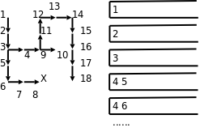

栈与队列
=================

数据结构的概念
---------------------

.. index:: s数据结构, Data Structure

数据结构（Data Structure）是数据的组织方式。程序中用到的数据都不是孤立的，而是有相互联系的，根据访问数据的需求不同，同样的数据可以有多种不同的组织方式。以前学过的复合类型也可以看作数据的组织方式：把同一类型的数据组织成数组，或者把描述同一对象的各成员组织成结构体。数据的组织方式包含了存储方式和访问方式这两层意思，二者是紧密联系的。例如，数组的各元素是一个挨一个存储的，并且每个元素的大小相同，因此数组可以提供按下标访问的方式（根据“元素大小×下标”可以找到相应元素在数组中的存储位置），结构体的各成员也是一个挨一个存储的，但是每个成员的大小不一定相同，所以只能用.运算符加成员名来访问，而不能按下标访问。

本章主要介绍栈和队列这两种数据结构以及它们的应用。从本章的应用实例可以看出，一个问题中数据的存储方式和访问方式就决定了解决问题可以采用什么样的算法，要设计一个算法就要同时设计相应的数据结构来支持这种算法。所以Pascal语言的设计者Niklaus Wirth提出： **算法+数据结构=程序** （详见 [ADSP]_ ）。

堆栈
--------------

.. index:: r入栈, Push, c出栈, Pop

在 :ref:`func2.recurse` 中我们已经对堆栈这种数据结构有了初步认识。堆栈是一组元素的集合，类似于数组，不同之处在于，数组可以按下标随机访问，这次访问 ``a[5]`` 下次可以访问 ``a[1]`` ，但是堆栈的访问规则被限制为Push和Pop两种操作，Push（入栈或压栈）向栈顶添加元素，Pop（出栈或弹出）则取出当前栈顶的元素，也就是说，只能访问栈顶元素而不能访问栈中其他元素。如果所有元素的类型相同，堆栈的存储也可以用数组来实现，访问操作可以通过函数接口提供。看下面的示例程序。

.. code-block:: c
   :linenos:

   #include <stdio.h>

   char stack[512];
   int top = 0;

   void push(char c)
   {
           stack[top++] = c;
   }

   char pop(void)
   {
           return stack[--top];
   }

   int is_empty(void)
   {
           return top == 0;
   }

   int main(void)
   {
           push('a');
           push('b');
           push('c');

           while (!is_empty())
                   putchar(pop());
           putchar('\n');

           return 0;
   }

运行结果是 ``cba`` 。运行过程图示如下：

.. figure:: ../images/stackqueue.stack.png

   用堆栈实现倒序打印

.. index:: z指针, Pointer, Class Invariant

数组 ``stack`` 是堆栈的存储空间，变量 ``top`` 总是保存数组中栈顶的下一个元素的下标，我们说“ ``top`` 总是指向栈顶的下一个元素”， ``top`` 也叫做栈顶指针（Pointer）。在 :ref:`sortsearch.insertion` 中介绍了Loop Invariant的概念，可以用它检验循环的正确性，这里的“ ``top`` 总是指向栈顶的下一个元素”其实也是一种Invariant，Push和Pop操作总是维持这个条件不变，这种Invariant描述的对象是一个数据结构而不是一个循环，在DbC中称为Class Invariant。

Pop操作的语义是取出栈顶元素，但上例的实现其实并没有清除原来的栈顶元素，只是把 ``top`` 指针移动了一下，原来的栈顶元素仍然存在那里，这就足够了，因为此后通过Push和Pop操作不可能再访问到已经取出的元素，下次Push操作就会覆盖它。 ``putchar`` 函数的作用是把一个字符打印到屏幕上，和 ``printf`` 的 ``%c`` 作用相同。Predicate函数 ``is_empty`` 的作用是防止Pop操作访问越界。这里我们预留了足够大的栈空间（512个元素），其实严格来说Push操作之前也应该检查栈是否满了。

.. index:: h后进先出, LIFO, Last In First Out

在 ``main`` 函数中，入栈的顺序是 ``'a'`` 、 ``'b'`` 、 ``'c'`` ，而出栈打印的顺序却是 ``'c'`` 、 ``'b'`` 、 ``'a'`` ，最后入栈的 ``'c'`` 最早出来，因此堆栈这种数据结构的特点可以概括为LIFO（Last In First Out，后进先出）。我们也可以写一个递归函数做倒序打印，利用函数调用的栈帧实现后进先出：

.. code-block:: c
   :linenos:

   #include <stdio.h>
   #define LEN 3

   char buf[LEN] = {'a', 'b', 'c'};

   void print_backward(int pos)
   {
           if (pos == LEN)
                   return;
           print_backward(pos+1);
           putchar(buf[pos]);
   }

   int main(void)
   {
           print_backward(0);
           putchar('\n');

           return 0;
   }

也许你会说，又是堆栈又是递归的，倒序打印一个数组犯得着这么大动干戈吗？写一个简单的循环不就行了：

.. code-block:: c
   :linenos:

   for (i = LEN-1; i >= 0; i--)
           putchar(buf[i]);

对于数组来说确实没必要搞这么复杂，因为数组既可以从前向后访问也可以从后向前访问，甚至可以随机访问，但有些数据结构的访问并没有这么自由，下一节你就会看到这样的数据结构。

.. _stackqueue.dfs:

深度优先搜索
-------------------

现在我们用堆栈解决一个有意思的问题，定义一个二维数组：

.. code-block:: c
   :linenos:

   int maze[5][5] = {
           0, 1, 0, 0, 0,
           0, 1, 0, 1, 0,
           0, 0, 0, 0, 0,
           0, 1, 1, 1, 0,
           0, 0, 0, 1, 0,
   };

它表示一个迷宫，其中的1表示墙壁，0表示可以走的路，只能横着走或竖着走，不能斜着走，要求编程序找出从左上角到右下角的路线。程序如下：

.. code-block:: c
   :linenos:

   #include <stdio.h>

   #define MAX_ROW 5
   #define MAX_COL 5

   struct point { int row, col; } stack[512];
   int top = 0;

   void push(struct point p)
   {
           stack[top++] = p;
   }

   struct point pop(void)
   {
           return stack[--top];
   }

   int is_empty(void)
   {
           return top == 0;
   }

   int maze[MAX_ROW][MAX_COL] = {
           0, 1, 0, 0, 0,
           0, 1, 0, 1, 0,
           0, 0, 0, 0, 0,
           0, 1, 1, 1, 0,
           0, 0, 0, 1, 0,
   };

   void print_maze(void)
   {
           int i, j;
           for (i = 0; i < MAX_ROW; i++) {
                   for (j = 0; j < MAX_COL; j++)
                           printf("%d ", maze[i][j]);
                   putchar('\n');
           }
           printf("*********\n");
   }

   struct point predecessor[MAX_ROW][MAX_COL] = {
           {{-1,-1}, {-1,-1}, {-1,-1}, {-1,-1}, {-1,-1}},
           {{-1,-1}, {-1,-1}, {-1,-1}, {-1,-1}, {-1,-1}},
           {{-1,-1}, {-1,-1}, {-1,-1}, {-1,-1}, {-1,-1}},
           {{-1,-1}, {-1,-1}, {-1,-1}, {-1,-1}, {-1,-1}},
           {{-1,-1}, {-1,-1}, {-1,-1}, {-1,-1}, {-1,-1}},
   };

   void visit(int row, int col, struct point pre)
   {
           struct point visit_point = { row, col };
           maze[row][col] = 2;
           predecessor[row][col] = pre;
           push(visit_point);
   }

   int main(void)
   {
           struct point p = { 0, 0 };

           maze[p.row][p.col] = 2;
           push(p);	

           while (!is_empty()) {
                   p = pop();
                   if (p.row == MAX_ROW - 1  /* goal */
                       && p.col == MAX_COL - 1)
                           break;
                   if (p.col+1 < MAX_COL     /* right */
                       && maze[p.row][p.col+1] == 0)
                           visit(p.row, p.col+1, p);
                   if (p.row+1 < MAX_ROW     /* down */
                       && maze[p.row+1][p.col] == 0)
                           visit(p.row+1, p.col, p);
                   if (p.col-1 >= 0          /* left */
                       && maze[p.row][p.col-1] == 0)
                           visit(p.row, p.col-1, p);
                   if (p.row-1 >= 0          /* up */
                       && maze[p.row-1][p.col] == 0)
                           visit(p.row-1, p.col, p);
                   print_maze();
           }
           if (p.row == MAX_ROW - 1 && p.col == MAX_COL - 1) {
                   printf("(%d, %d)\n", p.row, p.col);
                   while (predecessor[p.row][p.col].row != -1) {
                           p = predecessor[p.row][p.col];
                           printf("(%d, %d)\n", p.row, p.col);
                   }
           } else
                   printf("No path!\n");

           return 0;
   }

运行结果如下::

   2 1 0 0 0 
   2 1 0 1 0 
   0 0 0 0 0 
   0 1 1 1 0 
   0 0 0 1 0 
   *********
   2 1 0 0 0 
   2 1 0 1 0 
   2 0 0 0 0 
   0 1 1 1 0 
   0 0 0 1 0 
   *********
   2 1 0 0 0 
   2 1 0 1 0 
   2 2 0 0 0 
   2 1 1 1 0 
   0 0 0 1 0 
   *********
   2 1 0 0 0 
   2 1 0 1 0 
   2 2 0 0 0 
   2 1 1 1 0 
   2 0 0 1 0 
   *********
   2 1 0 0 0 
   2 1 0 1 0 
   2 2 0 0 0 
   2 1 1 1 0 
   2 2 0 1 0 
   *********
   2 1 0 0 0 
   2 1 0 1 0 
   2 2 0 0 0 
   2 1 1 1 0 
   2 2 2 1 0 
   *********
   2 1 0 0 0 
   2 1 0 1 0 
   2 2 0 0 0 
   2 1 1 1 0 
   2 2 2 1 0 
   *********
   2 1 0 0 0 
   2 1 0 1 0 
   2 2 2 0 0 
   2 1 1 1 0 
   2 2 2 1 0 
   *********
   2 1 0 0 0 
   2 1 2 1 0 
   2 2 2 2 0 
   2 1 1 1 0 
   2 2 2 1 0 
   *********
   2 1 2 0 0 
   2 1 2 1 0 
   2 2 2 2 0 
   2 1 1 1 0 
   2 2 2 1 0 
   *********
   2 1 2 2 0 
   2 1 2 1 0 
   2 2 2 2 0 
   2 1 1 1 0 
   2 2 2 1 0 
   *********
   2 1 2 2 2 
   2 1 2 1 0 
   2 2 2 2 0 
   2 1 1 1 0 
   2 2 2 1 0 
   *********
   2 1 2 2 2 
   2 1 2 1 2 
   2 2 2 2 0 
   2 1 1 1 0 
   2 2 2 1 0 
   *********
   2 1 2 2 2 
   2 1 2 1 2 
   2 2 2 2 2 
   2 1 1 1 0 
   2 2 2 1 0 
   *********
   2 1 2 2 2 
   2 1 2 1 2 
   2 2 2 2 2 
   2 1 1 1 2 
   2 2 2 1 0 
   *********
   2 1 2 2 2 
   2 1 2 1 2 
   2 2 2 2 2 
   2 1 1 1 2 
   2 2 2 1 2 
   *********
   (4, 4)
   (3, 4)
   (2, 4)
   (1, 4)
   (0, 4)
   (0, 3)
   (0, 2)
   (1, 2)
   (2, 2)
   (2, 1)
   (2, 0)
   (1, 0)
   (0, 0)

.. index:: q前趋, Predecessor, w伪代码, Pseudocode

这次堆栈里的元素是结构体类型的，用来表示迷宫中一个点的x和y坐标。我们用一个新的数据结构保存走迷宫的路线，每个走过的点都有一个前趋（Predecessor）点，表示是从哪儿走到当前点的，比如 ``predecessor[4][4]`` 是坐标为(3, 4)的点，就表示从(3, 4)走到了(4, 4)，一开始 ``predecessor`` 的各元素初始化为无效坐标(-1, -1)。在迷宫中探索路线的同时就把路线保存在 ``predecessor`` 数组中，已经走过的点在 ``maze`` 数组中记为2防止重复走，最后找到终点时就根据 ``predecessor`` 数组保存的路线从终点打印到起点。为了帮助理解，我把这个算法改写成伪代码（Pseudocode）如下：

.. code-block:: c
   :linenos:

   将起点标记为已走过并压栈;
   while (栈非空) {
           从栈顶弹出一个点p;
           if (p这个点是终点)
                   break;
           否则沿右、下、左、上四个方向探索相邻的点
           if (和p相邻的点有路可走，并且还没走过)
                   将相邻的点标记为已走过并压栈，它的前趋就是p点;
   }
   if (p点是终点) {
           打印p点的坐标;
           while (p点有前趋) {
                   p点 = p点的前趋;
                   打印p点的坐标;
           }
   } else
           没有路线可以到达终点;

.. index:: s深度优先搜索, DFS, Depth First Search

我在 ``while`` 循环的末尾插了打印语句，每探索一步都打印出当前迷宫的状态（标记了哪些点），从打印结果可以看出这种搜索算法的特点是：每次探索完各个方向相邻的点之后，取其中一个相邻的点走下去，一直走到无路可走了再退回来，取另一个相邻的点再走下去。这称为深度优先搜索（DFS，Depth First Search）。探索迷宫和堆栈变化的过程如下图所示。

   深度优先搜索

.. index:: h回溯, Backtrack

图中各点的编号表示探索顺序，堆栈中保存的应该是坐标，我在画图时为了直观就把各点的编号写在堆栈里了。可见正是堆栈后进先出的性质使这个算法具有了深度优先的特点。如果在探索问题的解时走进了死胡同，则需要退回来从另一条路继续探索，这种思想称为回溯（Backtrack），一个典型的例子是很多编程书上都会讲的八皇后问题。

最后我们打印终点的坐标并通过 ``predecessor`` 数据结构找到它的前趋，这样顺藤摸瓜一直打印到起点。那么能不能从起点到终点正向打印路线呢？在上一节我们看到，数组支持随机访问也支持顺序访问，如果在一个循环里打印数组，既可以正向打印也可以反向打印。但 ``predecessor`` 这种数据结构却有很多限制：

.. index:: h后继, Successor

#. 不能随机访问一条路线上的任意点，只能通过第一个点找到第二个点，通过第二个点再找到第三个点，因此只能 **顺序访问** 。
#. 每个点只知道它的前趋是谁，而不知道它的后继（Successor）是谁，所以只能 **反向顺序访问** 。

可见，有什么样的数据结构就决定了可以用什么样的算法。那为什么不再建一个 ``successor`` 数组来保存每个点的后继呢？从DFS算法的过程可以看出，虽然每个点的前趋只有一个，后继却不止一个，如果我们为每个点只保存一个后继，则无法保证这个后继指向正确的路线。由此可见，有什么样的算法就决定了可以用什么样的数据结构。设计算法和设计数据结构这两件工作是紧密联系的。

.. rubric:: 习题

#. 修改本节的程序，要求从起点到终点正向打印路线。你能想到几种办法？

#. 本节程序中 ``predecessor`` 这个数据结构占用的存储空间太多了，改变它的存储方式可以节省空间，想想该怎么改。

#. 上一节我们实现了一个基于堆栈的程序，然后改写成递归程序，用函数调用的栈帧替代自己实现的堆栈。本节的DFS算法也是基于堆栈的，请把它改写成递归程序，这样改写可以避免使用 ``predecessor`` 数据结构，想想该怎么做。

#. 本节的程序只要找到一条路线就退出了，而不再回溯，如果要求找到从起点到终点的所有路线，想想该怎么做。

队列与广度优先搜索
---------------------------

.. index:: d队列, Queue, r入队, Enqueue, c出队, Dequeue, x先进先出, FIFO, First In First Out

队列（Queue）也是一组元素的集合，也提供两种基本操作：Enqueue（入队）将元素添加到队尾，Dequeue（出队）从队头取出元素并返回。就像排队买票一样，先来先服务，先入队的人也是先出队的，这种方式称为FIFO（First In First Out，先进先出），有时候队列本身也被称为FIFO。

下面我们用队列解决迷宫问题。程序如下：

.. code-block:: c
   :linenos:

   #include <stdio.h>

   #define MAX_ROW 5
   #define MAX_COL 5

   struct point { int row, col, predecessor; } queue[512];
   int head = 0, tail = 0;

   void enqueue(struct point p)
   {
           queue[tail++] = p;
   }

   struct point dequeue(void)
   {
           return queue[head++];
   }

   int is_empty(void)
   {
           return head == tail;
   }

   int maze[MAX_ROW][MAX_COL] = {
           0, 1, 0, 0, 0,
           0, 1, 0, 1, 0,
           0, 0, 0, 0, 0,
           0, 1, 1, 1, 0,
           0, 0, 0, 1, 0,
   };

   void print_maze(void)
   {
           int i, j;
           for (i = 0; i < MAX_ROW; i++) {
                   for (j = 0; j < MAX_COL; j++)
                           printf("%d ", maze[i][j]);
                   putchar('\n');
           }
           printf("*********\n");
   }

   void visit(int row, int col)
   {
           struct point visit_point = { row, col, head-1 };
           maze[row][col] = 2;
           enqueue(visit_point);
   }

   int main(void)
   {
           struct point p = { 0, 0, -1 };

           maze[p.row][p.col] = 2;
           enqueue(p);

           while (!is_empty()) {
                   p = dequeue();
                   if (p.row == MAX_ROW - 1  /* goal */
                       && p.col == MAX_COL - 1)
                           break;
                   if (p.col+1 < MAX_COL     /* right */
                       && maze[p.row][p.col+1] == 0)
                           visit(p.row, p.col+1);
                   if (p.row+1 < MAX_ROW     /* down */
                       && maze[p.row+1][p.col] == 0)
                           visit(p.row+1, p.col);
                   if (p.col-1 >= 0          /* left */
                       && maze[p.row][p.col-1] == 0)
                           visit(p.row, p.col-1);
                   if (p.row-1 >= 0          /* up */
                       && maze[p.row-1][p.col] == 0)
                           visit(p.row-1, p.col);
                   print_maze();
           }
           if (p.row == MAX_ROW - 1 && p.col == MAX_COL - 1) {
                   printf("(%d, %d)\n", p.row, p.col);
                   while (p.predecessor != -1) {
                           p = queue[p.predecessor];
                           printf("(%d, %d)\n", p.row, p.col);
                   }
           } else
                   printf("No path!\n");

           return 0;
   }

运行结果如下::

   2 1 0 0 0 
   2 1 0 1 0 
   0 0 0 0 0 
   0 1 1 1 0 
   0 0 0 1 0 
   *********
   2 1 0 0 0 
   2 1 0 1 0 
   2 0 0 0 0 
   0 1 1 1 0 
   0 0 0 1 0 
   *********
   2 1 0 0 0 
   2 1 0 1 0 
   2 2 0 0 0 
   2 1 1 1 0 
   0 0 0 1 0 
   *********
   2 1 0 0 0 
   2 1 0 1 0 
   2 2 2 0 0 
   2 1 1 1 0 
   0 0 0 1 0 
   *********
   2 1 0 0 0 
   2 1 0 1 0 
   2 2 2 0 0 
   2 1 1 1 0 
   2 0 0 1 0 
   *********
   2 1 0 0 0 
   2 1 2 1 0 
   2 2 2 2 0 
   2 1 1 1 0 
   2 0 0 1 0 
   *********
   2 1 0 0 0 
   2 1 2 1 0 
   2 2 2 2 0 
   2 1 1 1 0 
   2 2 0 1 0 
   *********
   2 1 0 0 0 
   2 1 2 1 0 
   2 2 2 2 2 
   2 1 1 1 0 
   2 2 0 1 0 
   *********
   2 1 2 0 0 
   2 1 2 1 0 
   2 2 2 2 2 
   2 1 1 1 0 
   2 2 0 1 0 
   *********
   2 1 2 0 0 
   2 1 2 1 0 
   2 2 2 2 2 
   2 1 1 1 0 
   2 2 2 1 0 
   *********
   2 1 2 0 0 
   2 1 2 1 2 
   2 2 2 2 2 
   2 1 1 1 2 
   2 2 2 1 0 
   *********
   2 1 2 2 0 
   2 1 2 1 2 
   2 2 2 2 2 
   2 1 1 1 2 
   2 2 2 1 0 
   *********
   2 1 2 2 0 
   2 1 2 1 2 
   2 2 2 2 2 
   2 1 1 1 2 
   2 2 2 1 0 
   *********
   2 1 2 2 0 
   2 1 2 1 2 
   2 2 2 2 2 
   2 1 1 1 2 
   2 2 2 1 2 
   *********
   2 1 2 2 2 
   2 1 2 1 2 
   2 2 2 2 2 
   2 1 1 1 2 
   2 2 2 1 2 
   *********
   2 1 2 2 2 
   2 1 2 1 2 
   2 2 2 2 2 
   2 1 1 1 2 
   2 2 2 1 2 
   *********
   (4, 4)
   (3, 4)
   (2, 4)
   (2, 3)
   (2, 2)
   (2, 1)
   (2, 0)
   (1, 0)
   (0, 0)

其实仍然可以像上一节一样用 ``predecessor`` 数组表示每个点的前趋，但我想换一种更方便的数据结构，直接在每个点的结构体中加一个成员表示前趋：

.. code-block:: c
   :linenos:

   struct point { int row, col, predecessor; } queue[512];
   int head = 0, tail = 0;

变量 ``head`` 和 ``tail`` 是队头和队尾指针， ``head`` 总是指向队头， ``tail`` 总是指向队尾的下一个元素。每个点的 ``predecessor`` 成员也是一个指针，指向它的前趋在 ``queue`` 数组中的位置。如下图所示：

.. figure:: ../images/stackqueue.bfsqueue.png

   广度优先搜索的队列数据结构

为了帮助理解，我把这个算法改写成如下伪代码：

.. code-block:: c
   :linenos:

   将起点标记为已走过并入队;
   while (队列非空) {
           出队一个点p;
           if (p这个点是终点)
                   break;
           否则沿右、下、左、上四个方向探索相邻的点
           if (和p相邻的点有路可走，并且还没走过)
                   将相邻的点标记为已走过并入队，它的前趋就是刚出队的p点;
   }
   if (p点是终点) {
           打印p点的坐标;
           while (p点有前趋) {
                   p点 = p点的前趋;
                   打印p点的坐标;
           }
   } else
           没有路线可以到达终点;

.. index:: g广度优先搜索, BFS, Breadth First Search

从搜索过程的打印结果可以看出，这个算法的特点是沿各个方向同时展开搜索，每个可以走通的方向轮流往前走一步，这称为广度优先搜索（BFS，Breadth First Search）。探索迷宫和队列变化的过程如下图所示。

.. figure:: ../images/stackqueue.bfs.png

   广度优先搜索

广度优先是一种步步为营的策略，每次都从各个方向探索一步，将前线推进一步，图中的虚线就表示这个前线，队列中的元素总是由前线的点组成的，可见正是队列先进先出的性质使这个算法具有了广度优先的特点。广度优先搜索还有一个特点是可以找到从起点到终点的最短路径，而深度优先搜索找到的不一定是最短路径，比较本节和上一节程序的运行结果可以看出这一点，想一想为什么。

.. rubric:: 习题

#. 本节的例子直接在队列元素中加一个指针成员表示前趋，想一想为什么上一节不能采用这种方法表示前趋？

#. 本节例子中给队列分配的存储空间是512个元素，其实没必要这么多，那么解决这个问题至少要分配多少个元素的队列空间呢？跟什么因素有关？

环形队列
---------------------

.. index:: h环形队列, Circular Queue

比较前两节的栈操作和队列操作可以发现，栈操作的 ``top`` 指针在Push时增大而在Pop时减小，栈空间是可以重复利用的，而队列的 ``head`` 、 ``tail`` 指针都在一直增大，虽然前面的元素已经出队了，但它所占的存储空间却不能重复利用。在上一节迷宫问题的解法中，出队的元素仍然有用：保存着走过的点以及每个点的前趋，以便最后打印完整的路线。但大多数程序并不是这样使用队列的，一般情况下出队的元素就不再有保存价值了，这些元素的存储空间应该回收利用，由此想到把队列改造成环形队列（Circular Queue）：把 ``queue`` 数组想像成一个圈， ``head`` 和 ``tail`` 指针仍然是一直增大的，当指到数组末尾时就自动回到数组开头，就像两个人围着操场赛跑，沿着它们跑的方向看，从 ``head`` 到 ``tail`` 之间是队列的有效元素，从 ``tail`` 到 ``head`` 之间是空的存储位置，如果 ``head`` 追上 ``tail`` 就表示队列空了，如果 ``tail`` 追上 ``head`` 就表示队列的存储空间满了。如下图所示：

.. figure:: ../images/stackqueue.circular.png

   环形队列

注意上图中的第三个小图和最后一个小图，“ ``head`` 和 ``tail`` 指向相同的位置”既可能表示“队列空”也可能表示“队列满”，这是肯定不行的，在实现环形队列时必须要区分这两种状态，请思考一下可以用哪些办法来区分。

.. rubric:: 习题

#. 现在把迷宫问题的要求改一下，只要求程序给出最后结论就可以了，回答“有路能到达终点”或者“没有路能到达终点”，而不需要把路径打印出来。请把上一节迷宫问题的解法改用环形队列实现，然后试验一下解决这个问题至少需要分配多少个元素的队列空间。
