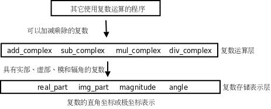

结构体
============

.. _struct.struct:

复合类型与结构体
---------------------

.. index:: j基本类型, Primitive Type, f复合类型, Compound Type

在编程语言中，最基本的、不可再分的数据类型称为基本类型（Primitive Type），例如整型、浮点型；根据语法规则由基本类型组合而成的类型称为复合类型（Compound Type），例如字符串是由很多字符组成的。有些场合下要把复合类型当作一个整体来用，而另外一些场合下需要分解组成这个复合类型的各种基本类型，复合类型的这种两面性为数据抽象（Data Abstraction）奠定了基础。 [SICP]_ 的1.1节指出，在学习一门编程语言时要特别注意以下三个方面：

.. index:: s数据抽象, Data Abstraction, g过程抽象, Procedure Abstraction

#. 这门语言提供了哪些Primitive，比如基本类型，比如基本运算符、表达式和语句。
#. 这门语言提供了哪些组合规则，比如基本类型如何组成复合类型，比如简单的表达式和语句如何组成复杂的表达式和语句。
#. 这门语言提供了哪些抽象机制，包括数据抽象和过程抽象（Procedure Abstraction）。

本章以结构体为例讲解数据类型的组合和数据抽象。至于过程抽象，我们在 :ref:`cond.ifelse` 已经见过最简单的形式，就是把一组语句用一个函数名封装起来，当作一个整体使用，本章将介绍更复杂的过程抽象。

现在我们用C语言表示一个复数。从直角坐标系来看，复数由实部和虚部组成，从极坐标系来看，复数由模和辐角组成，两种坐标系可以相互转换，如下图所示：

.. figure:: ../images/struct.complex.png

   复数

如果用实部和虚部表示一个复数，我们可以定义一种由两个 ``double`` 型组成的结构体类型来表示复数的类型：

.. code-block:: c
   :linenos:

   struct complex_struct {
           double x, y;
   };

需要说明几点：

.. index:: Tag

#. 这一句定义了标识符 ``complex_struct`` （同样要遵循标识符的命名规则），这种标识符在C语言中称为Tag。
#. 这一句就像变量声明一样，以;号结尾却不是个语句，事实上它是个类型声明（或者叫类型定义）。由于语句块和函数体的}后面不需要写;号，初学者在写结构体的类型定义时常犯的一个错误是忘了写}后面的;号，这一点要注意。
#. 在这句定义之后， ``struct complex_struct`` 就像 ``int`` 或 ``double`` 一样可以当类型名使用了 [#]_ 。唯一的区别是， ``int`` 或 ``double`` 是基本类型，而 ``struct complex_struct`` 是一种结构体类型，是由基本类型组合而成的复合类型。

.. [#] 其实C99已经定义了复数类型 ``_Complex`` 。如果包含C标准库的头文件 :file:`complex.h` ，也可以用 ``complex`` 做类型名。当然，只要不包含头文件 :file:`complex.h` 就可以自己定义标识符 ``complex`` ，但为了尽量减少混淆，本章的示例代码都用 ``complex_struct`` 做标识符而不用 ``complex`` 。

我们也可以在一条声明中既定义结构体类型又定义这种类型的变量：

.. code-block:: c
   :linenos:

   struct complex_struct {
           double x, y;
   } z1, z2;

在这句定义之后， ``z1`` 和 ``z2`` 就可以当变量名来访问了，而 ``struct complex_struct`` 也可以当类型名来使用了，接下来可以用 ``struct complex_struct`` 这个类型名再定义两个复数变量：

.. code-block:: c
   :linenos:

   struct complex_struct z3, z4;

如果要在定义结构体类型的同时定义变量，也可以不写Tag，例如：

.. code-block:: c
   :linenos:

   struct {
           double x, y;
   } z1, z2;

在这句定义之后，就只能访问变量 ``z1`` 和 ``z2`` ，而没法用这个结构体类型再定义其他变量了，因为这个结构体类型没有名字。

.. index:: c成员, Memeber, .号, Period

我们定义的每个复数变量都有两个成员（Member） ``x`` 和 ``y`` ，可以用.后缀运算符来访问，.号（Period）和成员名是变量名的后缀，比如表达式 ``z1.x`` 的值是复数变量 ``z1`` 的x坐标。下面是一个完整的例子：

.. code-block:: c
   :linenos:

   #include <stdio.h>

   int main(void)
   {
           struct complex_struct { double x, y; } z;
           double x = 3.0;	
           z.x = x;
           z.y = 4.0;
           if (z.y < 0)
                   printf("z=%f%fi\n", z.x, z.y);
           else
                   printf("z=%f+%fi\n", z.x, z.y);

           return 0;
   }

注意上例中变量 ``x`` 和变量 ``z`` 的成员 ``x`` 的名字并不冲突，因为变量 ``z`` 的成员 ``x`` 只能通过表达式 ``z.x`` 来访问，编译器可以从语法上区分哪个 ``x`` 是变量 ``x`` ，哪个 ``x`` 是变量 ``z`` 的成员 ``x`` ，在 :ref:`asmc.storage` 会讲到这两个标识符 ``x`` 属于不同的命名空间。

结构体类型也可以定义在全局作用域中，例如：

.. code-block:: c
   :linenos:

   struct complex_struct { double x, y; };

   int main(void)
   {
           struct complex_struct z;
           ...
   }

结构体变量也可以在定义时初始化，例如：

.. code-block:: c
   :linenos:

   struct complex_struct z = { 3.0, 4.0 };

Initializer中的数据依次赋给结构体的各成员。如果Initializer中的数据比结构体的成员多，编译器会报错，但如果只是末尾多个逗号则不算错。如果Initializer中的数据比结构体的成员少，未指定的成员将用0来初始化（就像未初始化的全局变量一样）。以下几种形式的初始化都是合法的：

.. code-block:: c
   :linenos:

   double x = 3.0;
   struct complex_struct z1 = { x, 4.0, }; /* z1.x=3.0, z1.y=4.0 */
   struct complex_struct z2 = { 3.0, }; /* z2.x=3.0, z2.y=0.0 */
   struct complex_struct z3 = { 0 }; /* z3.x=0.0, z3.y=0.0 */

注意， ``z1`` 必须是局部变量才能用另一个变量 ``x`` 的值来初始化它的成员，如果是全局变量就只能用常量表达式来初始化。这也是C99的新特性，C89只允许在{}中使用常量表达式来初始化，无论是初始化全局变量还是局部变量。

注意结构体的Initializer不能用于结构体的赋值，例如这样是错误的：

.. code-block:: c
   :linenos:

   struct complex_struct z1;
   z1 = { 3.0, 4.0 };

以前我们初始化基本类型的变量所使用的Initializer都是表达式，表达式当然也可以用来赋值，但现在这种由{}括起来的Initializer并不是表达式，所以不能用来赋值 [#]_ 。Initializer的语法总结如下::

   Initializer → 表达式
   Initializer → { 初始化列表 } 
   初始化列表 → Designated-Initializer, Designated-Initializer, ...
   （最后一个Designated-Initializer末尾可以有一个多余的,号）
   Designated-Initializer → Initializer
   Designated-Initializer → .标识符 = Initializer
   Designated-Initializer → [常量表达式] = Initializer

.. index:: Compound Literal

.. [#] C99引入一种新的表达式语法Compound Literal可以用来赋值，例如 ``z1 = (struct complex_struct){ 3.0, 4.0 };`` ，本书不使用这种新语法。

.. index:: Designated Initializer, x稀疏, Sparse, Memberwise Initialization

Designated Initializer是C99引入的新特性，用于初始化稀疏（Sparse）结构体和稀疏数组很方便。有些时候结构体或数组中只有某一个或某几个成员需要初始化，其他成员都用0初始化即可，用Designated Initializer语法可以针对每个成员做初始化（Memberwise Initialization），很方便。例如：

.. code-block:: c
   :linenos:

   struct complex_struct z1 = { .y = 4.0 }; /* z1.x=0.0, z1.y=4.0 */

数组的Memberwise Initialization语法将在下一章介绍。

.. index:: s算术类型, Arithmetic Type, b标量类型, Scalar Type

结构体类型用在表达式中有很多限制，不像基本类型那么自由，比如+ - * /等算术运算符和&& || !等逻辑运算符的操作数都不能是结构体类型， ``if`` 语句、 ``while`` 语句中的控制表达式的值也不能是结构体类型。严格来说，可以做算术运算的类型称为算术类型（Arithmetic Type），算术类型包括整型和浮点型。可以表示零和非零、可以参与逻辑与、或、非运算或者做控制表达式的类型称为标量类型（Scalar Type），标量类型包括算术类型和以后要讲的指针类型，详见 :ref:`pointer.type` 。

结构体变量之间使用赋值运算符是允许的，用一个结构体变量初始化另一个结构体变量也是允许的，例如：

.. code-block:: c
   :linenos:

   struct complex_struct z1 = { 3.0, 4.0 };
   struct complex_struct z2 = z1;
   z1 = z2;

注意 ``z2`` 必须是局部变量才能用变量 ``z1`` 来初始化。既然结构体变量之间可以相互赋值和初始化，也就可以当作函数的参数和返回值来传递：

.. code-block:: c
   :linenos:

   struct complex_struct add_complex(struct complex_struct z1, struct complex_struct z2)
   {
           z1.x = z1.x + z2.x;
           z1.y = z1.y + z2.y;
           return z1;
   }

这个函数实现了两个复数相加，如果在main函数中这样调用：

.. code-block:: c
   :linenos:

   struct complex_struct z = { 3.0, 4.0 };
   z = add_complex(z, z);

那么调用传参的过程如下图所示：

.. figure:: ../images/struct.parameter.png

   结构体传参

从上图可以看出，一个结构体变量的各成员的存储空间总是相邻的 [#]_ ，合在一起组成结构体变量的存储空间。变量 ``z`` 在 ``main`` 函数的栈帧上，参数 ``z1`` 和 ``z2`` 在 ``add_complex`` 函数的栈帧上， ``z`` 的值分别赋给 ``z1`` 和 ``z2`` 。在 ``add_complex`` 函数里， ``z2`` 的实部和虚部被累加到 ``z1`` 中，然后 ``return z1;`` 可以看成是：

#. 用 ``z1`` 初始化一个临时变量。
#. 函数返回并释放栈帧。
#. 把临时变量的值赋给变量 ``z`` ，释放临时变量。

.. [#] 我们在 :ref:`asmc.structunion` 会看到，结构体成员之间也可能有若干个填充字节。

由.后缀运算符组成的表达式能不能做左值取决于.后缀运算符左边的操作数能不能做左值。在上面的例子中， ``z`` 是一个变量，可以做左值，因此表达式 ``z.x`` 也可以做左值，但表达式 ``add_complex(z, z).x`` 只能做右值而不能做左值，因为 ``add_complex(z, z)`` 的返回值是个临时变量，不能做左值。

.. _struct.dataabstraction:

数据抽象
--------------------

现在我们来实现一个完整的复数运算程序。在上一节我们已经定义了复数的结构体类型，现在需要围绕它定义一些函数。复数可以用直角坐标或极坐标表示，直角坐标做加减法比较方便，极坐标做乘除法比较方便。如果我们定义的复数结构体是直角坐标的，那么应该提供极坐标的转换函数，以便在需要的时候可以方便地取它的模和辐角：

.. code-block:: c
   :linenos:

   #include <math.h>

   struct complex_struct {
           double x, y;
   };

   double real_part(struct complex_struct z)
   {
           return z.x;
   }

   double img_part(struct complex_struct z)
   {
           return z.y;
   }

   double magnitude(struct complex_struct z)
   {
           return sqrt(z.x * z.x + z.y * z.y);
   }

   double angle(struct complex_struct z)
   {
           return atan2(z.y, z.x);
   }

此外，我们还提供两个函数用来构造复数变量，参数既可以是直角坐标也可以是极坐标，在函数中自动做相应的转换然后返回构造的复数变量：

.. code-block:: c
   :linenos:

   struct complex_struct make_from_real_img(double x, double y)
   {
           struct complex_struct z;
           z.x = x;
           z.y = y;
           return z;
   }

   struct complex_struct make_from_mag_ang(double r, double A)
   {
           struct complex_struct z;
           z.x = r * cos(A);
           z.y = r * sin(A);
           return z;
   }

在此基础上就可以实现复数的加减乘除运算了：

.. code-block:: c
   :linenos:

   struct complex_struct add_complex(struct complex_struct z1, struct complex_struct z2)
   {
           return make_from_real_img(real_part(z1) + real_part(z2),
                                     img_part(z1) + img_part(z2));
   }

   struct complex_struct sub_complex(struct complex_struct z1, struct complex_struct z2)
   {
           return make_from_real_img(real_part(z1) - real_part(z2),
                                     img_part(z1) - img_part(z2));
   }

   struct complex_struct mul_complex(struct complex_struct z1, struct complex_struct z2)
   {
           return make_from_mag_ang(magnitude(z1) * magnitude(z2),
                                    angle(z1) + angle(z2));
   }

   struct complex_struct div_complex(struct complex_struct z1, struct complex_struct z2)
   {
           return make_from_mag_ang(magnitude(z1) / magnitude(z2),
                                    angle(z1) - angle(z2));
   }

可以看出，复数加减乘除运算的实现并没有直接访问结构体 ``struct complex_struct`` 的成员 ``x`` 和 ``y`` ，而是把它看成一个整体，通过调用相关函数来取它的直角坐标和极坐标。这样就可以非常方便地替换掉结构体 ``struct complex_struct`` 的存储表示，例如改为用极坐标来存储：

.. code-block:: c
   :linenos:

   #include <math.h>

   struct complex_struct {
           double r, A;
   };

   double real_part(struct complex_struct z)
   {
           return z.r * cos(z.A);
   }

   double img_part(struct complex_struct z)
   {
           return z.r * sin(z.A);
   }

   double magnitude(struct complex_struct z)
   {
           return z.r;
   }

   double angle(struct complex_struct z)
   {
           return z.A;
   }

   struct complex_struct make_from_real_img(double x, double y)
   {
           struct complex_struct z;
           z.A = atan2(y, x);
           z.r = sqrt(x * x + y * y);
           return z;
   }

   struct complex_struct make_from_mag_ang(double r, double A)
   {
           struct complex_struct z;
           z.r = r;
           z.A = A;
           return z;
   }

虽然结构体 ``complex_struct`` 的存储表示做了这样的改动， ``add_complex`` 、 ``sub_complex`` 、 ``mul_complex`` 、 ``div_complex`` 这几个复数运算的函数却不需要做任何改动，仍然可以用，原因在于这几个函数只把结构体 ``complex_struct`` 当作一个整体来使用，而没有直接访问它的成员，因此也不依赖于它有哪些成员。我们结合下图具体分析一下。

   数据抽象

这是一种抽象的思想。其实“抽象”这个概念并没有那么抽象，简单地说就是“提取公因式”：ab+ac=a(b+c)。如果a变了，ab和ac这两项都需要改，但如果写成a(b+c)的形式，只需要改一个地方就够了。

在我们的复数运算程序中，复数有可能用直角坐标或极坐标来表示，我们把这个有可能变动的因素提取出来组成复数存储表示层： ``real_part`` 、 ``img_part`` 、 ``magnitude`` 、 ``angle`` 、 ``make_from_real_img`` 、 ``make_from_mag_ang`` 。这一层看到的数据是结构体的两个成员 ``x`` 和 ``y`` ，或者 ``r`` 和 ``A`` ，如果改变了结构体的实现就要改变这一层函数的实现，但函数接口不改变，因此调用这一层函数接口的复数运算层不需要改变。复数运算层看到的数据只是一个抽象的“复数”的概念，知道它有直角坐标和极坐标，可以调用复数存储表示层的函数得到这些坐标。再往上看，其他使用复数运算的程序看到的数据是一个更为抽象的“复数”的概念，只知道它是一个数，像整数、小数一样可以加减乘除，甚至连它有直角坐标和极坐标也不需要知道。

.. index:: c抽象层, Abstraction Layer

这里的复数存储表示层和复数运算层称为抽象层（Abstraction Layer），从底层往上层来看，复数越来越抽象了，把所有这些层组合在一起就是一个完整的系统。 **组合使得系统可以任意复杂，而抽象使得系统的复杂性是可以控制的，任何改动都只局限在某一层，而不会波及整个系统。** 著名的计算机科学家Butler Lampson说过：“All problems in computer science can be solved by another level of indirection.”这里的indirection其实就是abstraction的意思。

.. rubric:: 习题

#. 在本节的基础上实现一个打印复数的函数，打印的格式是x+yi，如果实部或虚部为0则省略，例如： ``1.0`` 、 ``-2.0i`` 、 ``-1.0+2.0i`` 、 ``1.0-2.0i`` 。最后编写一个 ``main`` 函数测试本节的所有代码。想一想这个打印函数应该属于上图中的哪一层？

#. 实现一个用分子分母的格式来表示有理数的结构体类型 ``struct rational`` 以及相关的函数， ``struct rational`` 结构体类型之间可以做加减乘除运算，运算的结果仍然是 ``struct rational`` 类型。测试代码如下：

   .. code-block:: c
      :linenos:

      int main(void)
      {
              struct rational a = make_rational(1, 8); /* a=1/8 */
              struct rational b = make_rational(-1, 8); /* b=-1/8 */
              print_rational(add_rational(a, b));
              print_rational(sub_rational(a, b));
              print_rational(mul_rational(a, b));
              print_rational(div_rational(a, b));

              return 0;
      }

   注意要约分为最简分数，例如1/8和-1/8相减的打印结果应该是1/4而不是2/8，可以利用 :ref:`func2.recurse` 练习题中的Euclid算法来约分。在动手编程之前先思考一下这个问题实现了什么样的数据抽象，抽象层应该由哪些函数组成。

.. _struct.typetag:

数据类型标志
---------------

.. index:: s适配, Adapt

在上一节中，我们通过一个复数存储表示抽象层把 ``struct complex_struct`` 结构体的存储格式和上层的复数运算函数隔离开， ``struct complex_struct`` 结构体既可以采用直角坐标也可以采用极坐标存储。但有时候需要同时支持两种存储格式，比如先前已经采集了一些数据存在计算机中，有些数据是以极坐标存储的，有些数据是以直角坐标存储的，如果要把这些数据都存到 ``struct complex_struct`` 结构体中怎么办？一种办法是规定 `` struct complex_struct`` 结构体采用直角坐标格式，直角坐标的数据可以直接存入 `` struct complex_struct`` 结构体，而极坐标的数据先转成直角坐标再存，但由于浮点数的精度有限，转换总是会损失精度的。这里介绍另一种办法， ``struct complex_struct`` 结构体由一个数据类型标志和两个浮点数组成，如果数据类型标志为0，那么两个浮点数就表示直角坐标，如果数据类型标志为1，那么两个浮点数就表示极坐标。这样，直角坐标和极坐标的数据都可以适配（Adapt）到 ``struct complex_struct`` 结构体中，无需转换和损失精度：

.. code-block:: c
   :linenos:

   enum coordinate_type { RECTANGULAR, POLAR };
   struct complex_struct {
           enum coordinate_type t;
           double a, b;
   };

.. index:: m枚举, Enumeration

``enum`` 关键字的作用和 ``struct`` 关键字类似，把 ``coordinate_type`` 这个标识符定义为一个Tag， ``struct complex_struct`` 表示一个结构体类型，而 ``enum coordinate_type`` 表示一个枚举（Enumeration）类型。枚举类型的成员是常量，它们的值由编译器自动分配，例如定义了上面的枚举类型之后， ``RECTANGULAR`` 就表示常量0， ``POLAR`` 表示常量1。如果不希望从0开始分配，可以这样定义：

.. code-block:: c
   :linenos:

   enum coordinate_type { RECTANGULAR = 1, POLAR };

这样， ``RECTANGULAR`` 就表示常量1，而 ``POLAR`` 表示常量2。枚举常量也是一种整型，其值在编译时确定，因此也可以出现在常量表达式中，可以用于初始化全局变量或者作为case分支的判断条件。

有一点需要注意，虽然结构体的成员名和变量名不在同一命名空间中，但枚举的成员名却和变量名在同一命名空间中，所以会出现命名冲突。例如这样是不合法的：

.. code-block:: c
   :linenos:

   int main(void)
   {
           enum coordinate_type { RECTANGULAR = 1, POLAR };
           int RECTANGULAR;
           printf("%d %d\n", RECTANGULAR, POLAR);
           return 0;
   }

``struct complex_struct`` 结构体的格式变了，就需要修改复数存储表示层的函数，但只要保持函数接口不变就不会影响到上层函数。例如：

.. code-block:: c
   :linenos:

   struct complex_struct make_from_real_img(double x, double y)
   {
           struct complex_struct z;
           z.t = RECTANGULAR;
           z.a = x;
           z.b = y;
           return z;
   }

   struct complex_struct make_from_mag_ang(double r, double A)
   {
           struct complex_struct z;
           z.t = POLAR;
           z.a = r;
           z.b = A;
           return z;
   }

习题

#. 本节只给出了 ``make_from_real_img`` 和 ``make_from_mag_ang`` 函数的实现，请读者自己实现 ``real_part`` 、 ``img_part`` 、 ``magnitude`` 、 ``angle`` 这些函数。

#. 编译运行下面这段程序：

   .. code-block:: c
      :linenos:

      #include <stdio.h>

      enum coordinate_type { RECTANGULAR = 1, POLAR };

      int main(void)
      {
              int RECTANGULAR;
              printf("%d %d\n", RECTANGULAR, POLAR);
              return 0;
      }

结果是什么？并解释一下为什么是这样的结果。

嵌套结构体
------------------

结构体也是一种递归定义：结构体的成员具有某种数据类型，而结构体本身也是一种数据类型。换句话说，结构体的成员可以是另一个结构体，即结构体可以嵌套定义。例如我们在复数的基础上定义复平面上的线段：

.. code-block:: c
   :linenos:

   struct segment {
           struct complex_struct start;
           struct complex_struct end;
   };

从 :ref:`struct.struct` 讲的Initializer的语法可以看出，Initializer也可以嵌套，因此嵌套结构体可以嵌套地初始化，例如：

.. code-block:: c
   :linenos:

   struct segment s = {{ 1.0, 2.0 }, { 4.0, 6.0 }};

.. index:: p平坦, Flat

也可以平坦（Flat）地初始化。例如：

.. code-block:: c
   :linenos:

   struct segment s = { 1.0, 2.0, 4.0, 6.0 };

甚至可以把两种方式混合使用（这样可读性很差，应该避免）：

.. code-block:: c
   :linenos:

   struct segment s = {{ 1.0, 2.0 }, 4.0, 6.0 };

利用C99的新特性也可以做Memberwise Initialization，例如 [#]_ ：

.. [#] 为了便于理解， :ref:`struct.struct` 讲的Initializer语法并没有描述这种复杂的用法。

.. code-block:: c
   :linenos:

   struct segment s = { .start.x = 1.0, .end.x = 2.0 };

访问嵌套结构体的成员要用到多个.后缀运算符，例如：

.. code-block:: c
   :linenos:

   s.start.t = RECTANGULAR;
   s.start.a = 1.0;
   s.start.b = 2.0;
